# 🏗️ Architecture

## 🧩 Purpose

This file explains the system design for SynaWeave CE.
It is intentionally visual and diagram-heavy so the repo shows the product, platform, and pedagogy shape clearly.

For locked infra choices and naming rules, read:
- `docs/infra.md`
- `docs/legend.md`

---

## 🧠 Architecture thesis

SynaWeave CE is a **knowledge-weaving learning OS**.
It combines:
- a capture engine
- a knowledge engine
- a study engine
- an adaptive tutor
- a visible data and ML platform

The tutor is not just a chatbot.
It is an orchestrator that chooses the right teaching mode for the learner, concept, and study goal.

---

## 🔒 Locked learning-system pillars

These product pillars are non-negotiable inside the core architecture:
- block-based second-brain workspace
- deep-linked source provenance
- spaced repetition and retrieval practice
- Zettelkasten-style concept linking
- Feynman-style explain-back tutoring
- adaptive agentic tutoring
- programming-native pedagogy for SWE, ML, and AI learners
- learner-state modeling and personalization
- graph-grounded retrieval and recommendation
- evaluation and observability that remain visible as product assets

---

## 🔒 Locked tutor contract

The adaptive tutor must choose among multiple modes rather than collapsing every study event into one chat response.

The decision inputs are:
- learner state
- source type
- concept difficulty
- confidence and confusion signals
- forgetting risk
- study goal
- interview readiness
- modality fit for the concept

The first locked mode family is:
- free recall
- fill in the blank
- explain-back
- conversation-style coaching
- refined multiple choice
- matching pairs
- sequencing and ordering
- hotspot and image mapping
- branching scenarios
- interview-style prompts
- Parsons or code-ordering reconstruction
- worked-example completion
- debug-the-mistake
- compare-and-justify
- system-design walkthrough
- experiment-analysis walkthrough

---

## 🌐 System map

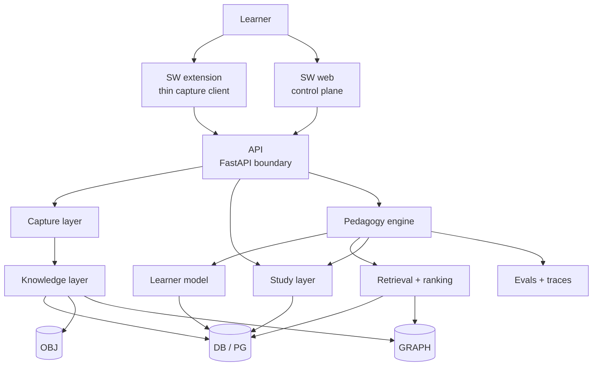

---

## 🧱 Product planes

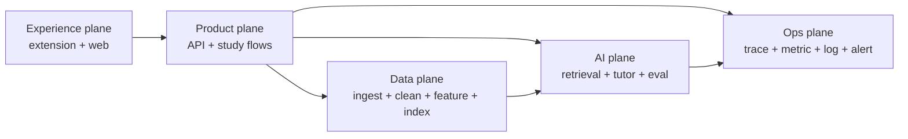

### Experience plane
- extension side panel
- web dashboard
- block-based learning canvas
- recommendations and tutor UI

### Product plane
- API boundary
- auth/session checks
- study state writes
- card editing and study history

### Data plane
- ingest
- clean
- chunk
- label
- embed
- graph link
- index
- feature engineering

### AI plane
- retrieval
- reranking
- pedagogy engine
- learner-state updates
- recommendation logic
- eval feedback loops

### Ops plane
- OTel traces
- metrics
- logs
- eval dashboards
- experiment records

---

## 📝 Capture-to-study flow

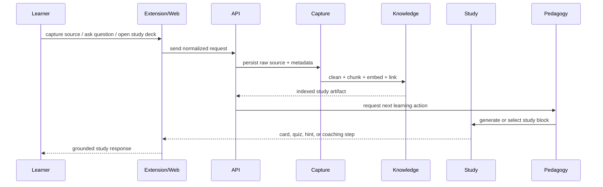

---

## 🤖 Pedagogy engine

The pedagogy engine is the tutor’s decision system.
It should select mode based on:
- learner state
- source type
- concept difficulty
- confidence / confusion signal
- forgetting risk
- study goal
- interview readiness
- modality fit

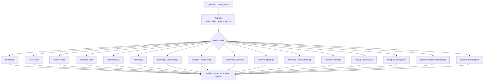

---

## 🧠 Learner-state model

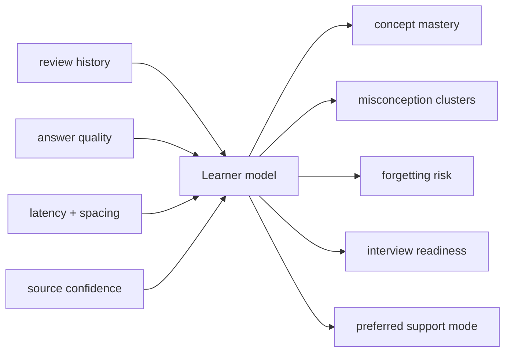

The learner model should track:
- concept mastery
- misconception clusters
- question intent
- source confidence
- forgetting risk
- interview readiness
- preferred support mode
- review history by concept and artifact type

---

## 👨‍💻 SWE / ML / AI pedagogy layer

This product is programming-native by design.
The tutor must natively support:
- code tracing
- algorithm sequencing
- pipeline ordering
- architecture tradeoff reasoning
- eval design
- debugging and failure analysis
- interview rehearsal
- notebook and experiment interpretation

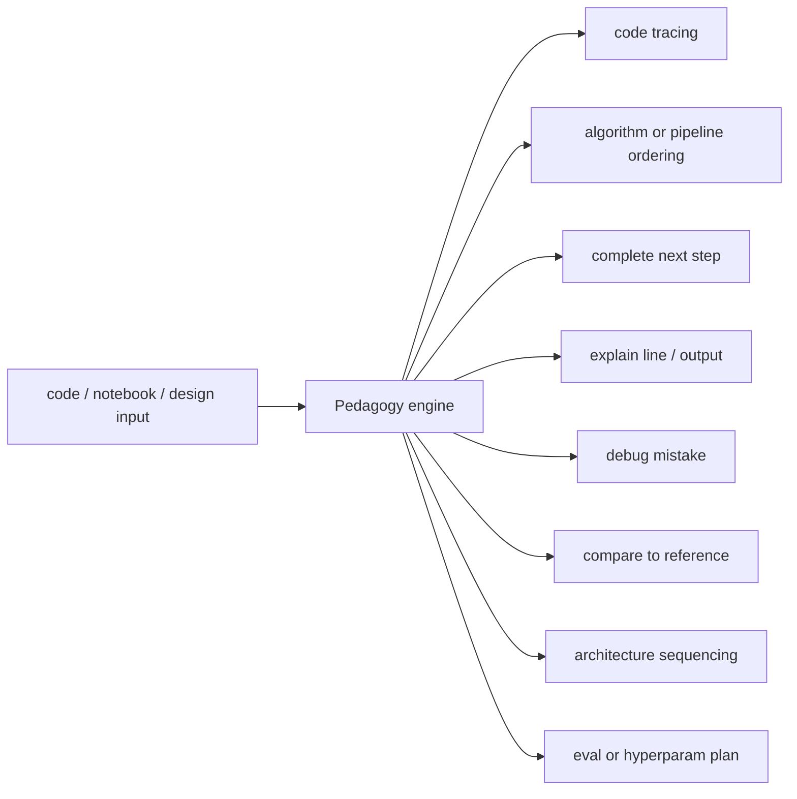

---

## 🔍 Retrieval and recommendation stack

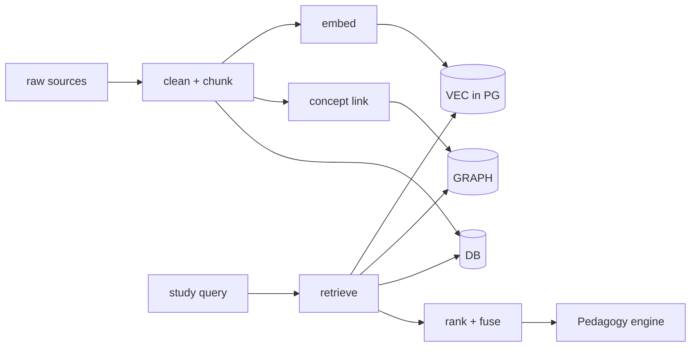

The first retrieval stack should stay simple where possible:
- DB + pgvector first
- graph augmentation where it materially improves the result
- recommendation logic driven by learner state and study history

---

## 🧪 Evals and observability as product assets

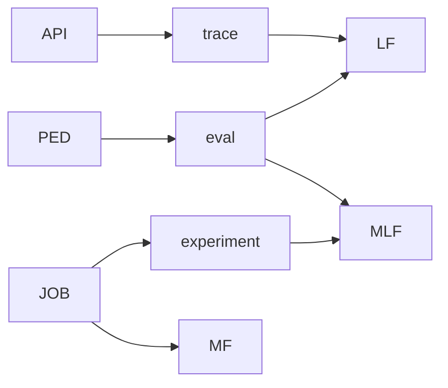

These are not hidden admin leftovers.
They should be visible in:
- internal dashboards
- tutor quality reviews
- experiment comparisons
- ingestion quality checks
- recommendation quality checks

---

## 🔐 Fail-open and fail-closed architecture

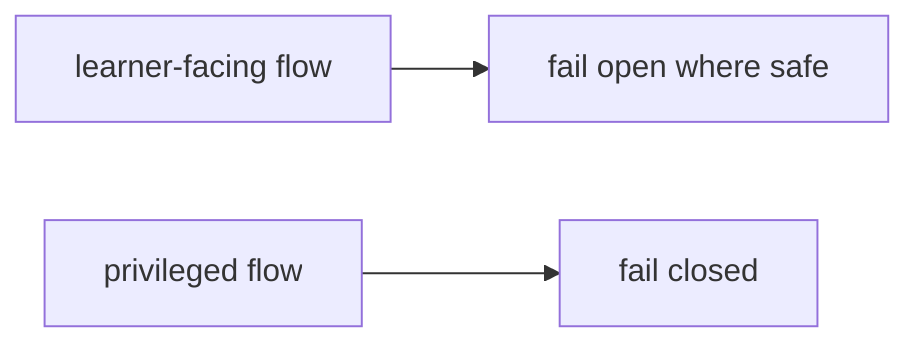

Fail open examples:
- recommendation refresh
- non-critical graph enrichment
- optional telemetry fan-out
- best-effort tagging or grouping

Fail closed examples:
- auth/session checks
- destructive writes
- admin tools
- billing and entitlements
- policy enforcement

---

## 🧩 Open-core split

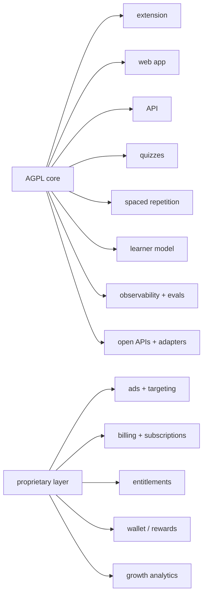

The AGPL core owns product learning value.
The proprietary layer owns monetization and growth mechanics.

---

## 🚀 Deployment posture

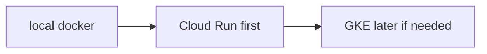

The repo should already have the seams for the GKE pivot, but Cloud Run is still the right first hosted move.
