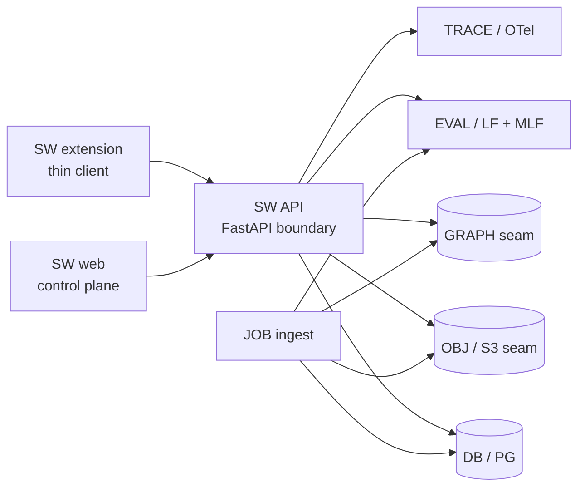

# 📜 Infra

## 🧩 Purpose

This is the **authoritative locked-choices document** for infrastructure, runtime hosting, provider seams, and config naming.

This file owns:
- locked infra choices
- hosting posture
- config and secret boundaries
- generic-vs-provider naming rules at the infra layer
- scale seams that must exist now even if activation happens later
- temporary env aliasing during naming migrations

This file does **not** own app/package/module boundaries.
Short generic env names are canonical here; older aliases may exist briefly in loaders during migration.
Those belong in:
- `docs/architecture.md`
- `docs/apps.md`
- `docs/packages.md`
- `docs/python.md`

---

## 🔒 Locked choices

These are non-negotiable unless a later ADR replaces them.

### Product and repo shape

- the product is a **monorepo**
- the repo is intentionally overbuilt for staff-level signaling and funding diligence
- the extension is a **thin client**, not the product brain
- the web app is the **control plane**
- the backend boundary is **FastAPI**
- repo-wide task running and package management use **Bun**
- Docker is the default packaging unit for local proof and hosted runtime prep
- the main learning canvas is a **block-based second-brain workspace**
- **deep-linked source provenance**, **SRS**, **Zettelkasten-style linking**, and **explain-back tutoring** are locked product pillars
- **graph-grounded retrieval and recommendation** plus **learner-state modeling** are locked product capabilities
- the AGPL core owns learning value; monetization, entitlements, ads, and rewards live outside the core repo

### Tutor and pedagogy contract

These choices are locked even when implementation depth lands later:
- the tutor is an **orchestrator**, not a plain chat responder
- tutoring mode selection must key off learner state, risk, goal, source type, and modality fit
- the product is **programming-native** for SWE, ML, and AI learners
- code tracing, ordering, debugging, experiment analysis, and interview rehearsal are first-class tutoring concerns

`docs/architecture.md` owns the full adaptive-tutor mode list and pedagogy flow.

### Hosting posture

- **Cloud Run first** for request-serving runtimes and jobs
- **GKE later** as the scale pivot, with the seam designed now
- **GitHub Pages** for public docs and marketing when activated
- **fail open for user experience** where safe
- **fail closed for privileged operations**, policy, billing, and destructive writes

### Data posture

- **Postgres is operational truth**
- the first hosted DB/auth/storage target is **SB** behind owned adapters
- **pgvector-first** retrieval is allowed inside Postgres where it remains cost-effective
- **B2** is the default low-cost object and temp storage target behind an S3-compatible seam
- **N4J** is the graph target behind a graph adapter seam
- do not duplicate providers for stored data types unless the product or economics clearly justify it

### AI / ML posture

- start with **RAG + evals**
- add **small task models** second
- add **PEFT / fine-tuning** later when enough clean labeled data exists
- make data cleaning and data engineering visible product and platform features
- maintain separate layers for classical ML, PyTorch, NLP, fine-tuning, and experiment orchestration

### Observability posture

- observability and evals are product assets, not hidden ops leftovers
- traces, metrics, logs, evals, and experiment records must be visible and durable
- **LF**, **MLF**, and **MF** sit behind owned seams
- local proof is not enough once the team needs shared durable evidence

---

## 🧭 Naming contract

Infra naming follows `docs/legend.md`.

Summary:
- generic names first
- provider names only at adapter or deploy edges
- raw identifiers max 5 words, 1–2 preferred
- contract names should survive provider swaps

Good:
- `DB_URL`
- `OBJ_BUCKET`
- `GRAPH_URL`
- `TRACE_OTLP_URL`
- `EVAL_URL`
- `EXP_URL`
- `GCP_PROJECT_ID`

Bad:
- `SUPABASE_VECTOR_DATABASE_URL`
- `BACKBLAZE_TEMPORARY_OBJECT_BUCKET_NAME`
- `THE_LANGFUSE_SERVER_FOR_ALL_TRACES`

---

## 🌐 Runtime map

---

## ☁️ Hosting strategy

### Now

Use Cloud Run for:
- API service
- ingest jobs
- small internal tools that fit request or job runtime boundaries

Why:
- cheap early entry
- Docker-native flow
- simple GCP path with your existing credits
- lower ops cost than early GKE

### Later

Keep GKE-ready seams for:
- stateful sidecars you truly need to manage yourself
- higher-throughput queue and worker fleets
- more complex network policy or cluster-level scheduling needs
- cases where Cloud Run deployment ergonomics stop fitting the product

The key rule:
- **design the seam now**
- **pay for the extra platform depth later**

---

## 🧱 Provider posture by concern

| Concern | Canonical name | First target | Why |
| --- | --- | --- | --- |
| API runtime | API | GCP Cloud Run | cheap first hosted path |
| job runtime | JOB | GCP Cloud Run Jobs | clear async seam |
| operational DB | DB | SBDB | hosted PG with a fast start |
| auth | AUTH | SB Auth + OIDC | quick public auth path |
| object storage | OBJ | B2 | low-cost S3-compatible storage |
| graph | GRAPH | N4J | graph RAG and relationship depth |
| API edge | EDGE | ZP | gateway and policy seam |
| traces and AI eval | EVAL / TRACE | LF | trace and online eval surface |
| experiment tracking | EXP | MLF | offline experiment and registry seam |
| workflow orchestration | FLOW | MF | DS / ML workflow durability |

These are current targets, not domain commitments.
The core repo should talk about **DB**, **OBJ**, **GRAPH**, **TRACE**, and **EVAL** more than it talks about vendors.

---

## 🔐 Secret and config rules

### Browser-safe config

Use browser-safe config only for:
- app URLs
- public auth entrypoints
- publishable keys
- non-sensitive feature flags

### Server-only config

Use server-only config for:
- DB creds
- service-role keys
- object-storage secrets
- graph creds
- eval and experiment write keys
- gateway admin keys
- mail and OAuth secrets

### Mapping rule

The repo-level env contract should stay short and generic.
If a provider SDK or deploy target requires a provider-specific alias, do that mapping in:
- app-local loaders
- adapter-local loaders
- deployment manifests

Do **not** let provider alias names become the main repo language.

---

## 🪜 Fail-open vs fail-closed

### Fail open where user experience should degrade gracefully

Examples:
- recommendation refresh
- non-critical graph enrichment
- optional eval writebacks
- optional telemetry fan-out
- best-effort background grouping

### Fail closed where correctness or abuse prevention matters

Examples:
- auth/session verification
- privileged admin actions
- destructive writes
- billing, entitlements, or wallet logic
- security-policy enforcement
- migration and schema-write paths

The platform should hide instability from the learner where safe, while making operational truth obvious to developers and operators.

---

## 🧠 Shared durable evidence

Local proof is useful but not enough once the team is collaborating on AI and ML behavior.
The shared durable evidence stack should support:
- trace review
- eval review
- experiment comparison
- artifact lineage
- model and prompt iteration review
- replayable failure analysis

The target shape is:
- **LF** for trace-linked online AI quality evidence
- **MLF** for experiments, offline evals, model registry, and artifact lineage
- **MF** for repeatable data and ML flows
- **DB** for operational truth and selected learning analytics
- **OBJ** for artifacts too large or wrong-shaped for DB storage

---

## 🪄 What the repo should already account for even before activation

Even if not fully active in Sprint 1, the repo and docs must already account for:
- DB scaling seams
- read replicas and future sharding seams
- queue seams
- cache seams
- graph seams
- model-serving seams
- workflow orchestration seams
- GKE-ready deploy seams
- proprietary monetization split outside the AGPL core

That is intentional overbuild, not accidental complexity.
