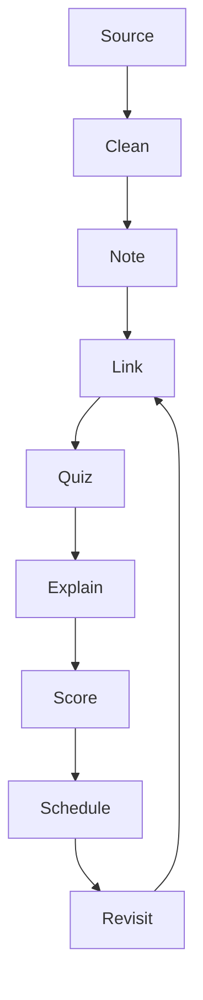
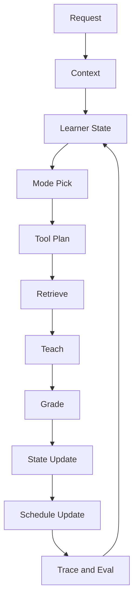
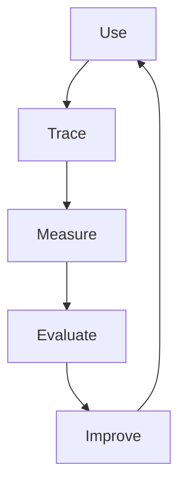

# 🛣️ Master Planning

## 🧩 Purpose

This document is the source of truth for the **program-level build plan** of the rebuild. It defines the planning hierarchy, naming rules, sprint map, deliverable sequencing, and the standards that every sprint plan must follow.

This file is intentionally broader than any individual sprint file. It answers:

* how planning is structured
* what each sprint is meant to accomplish
* how deliverables are named and organized
* what is required before later expansion work begins
* how plans, ADRs, docs, testing, and implementation stay aligned

This file does **not** replace sprint planning files. It governs them.

---

## 🧭 Planning hierarchy

The planning hierarchy is fixed:

```text id="vq8sgy"
🛣️ Sprint
  └─ 🚚 Deliverable
       └─ 🎟️ Task
```

### 🛣️ Sprint

A sprint is a major time-boxed build stage with a clear program objective.

### 🚚 Deliverable

A deliverable is a concrete, shippable outcome inside a sprint.

### 🎟️ Task

A task is an implementation item required to complete a deliverable.

No other planning hierarchy should be introduced unless this file is updated first.

---

## 📜 Planning file layout

All planning files live under:

```text id="nyl49z"
docs/planning/
```

Each sprint gets its own folder:

```text id="g8c1h1"
docs/planning/sprint-001/
docs/planning/sprint-002/
docs/planning/sprint-003/
...
```

Each sprint folder must contain:

* `overview.md`
* one file per deliverable

### 📜 Deliverable file naming

Deliverable files must use this pattern:

```text id="f4xsmz"
d1-name.md
d2-name.md
d3-name.md
```

Example:

```text id="gh09rn"
docs/planning/sprint-001/d1-foundation.md
docs/planning/sprint-001/d2-runtime.md
docs/planning/sprint-001/d3-quality.md
```

### 📜 ADR relationship

Each sprint must also have one ADR file:

```text id="vh8dgv"
docs/adrs/sprint-001.md
docs/adrs/sprint-002.md
docs/adrs/sprint-003.md
```

The sprint ADR records the architectural decisions that shaped that sprint. The sprint planning files record how those decisions are executed.

---

## 📦 Planning scope rules

This rebuild is governed by the following scope rules:

* every 🚚 deliverable must be production-ready for live users within the scope it owns
* every 🚚 deliverable must increase product usefulness, robustness, or observability
* every 🎟️ task must already have its decisions made in the plan before implementation begins
* every durable technical decision must appear in docs, not remain implicit in code
* every sprint must preserve provider optionality through adapter-based design
* every sprint must keep folder structure shallow and semantic
* every sprint must update docs, templates, tests, and telemetry when implementation changes

## 🧾 Template relationship

Recurring planning, ADR, spec, and verification artifacts must reuse `docs/templates/`.

That means:

* `docs/templates/planning/` owns reusable sprint and deliverable structure
* `docs/templates/adrs/` owns reusable sprint ADR structure
* `docs/templates/specs/` owns reusable cross-boundary spec structure
* `docs/templates/tests/` owns reusable verification packet structure

Owner docs still define the durable rules. Templates standardize the recurring artifact shape only.

---

## 🧠 Product thesis

The product is being rebuilt as an **AI and ML study intelligence platform** focused on actively weaving knowledge for users so they can learn more, deeper, faster, and retain that knowledge better.

The product direction is shaped by:

* spaced repetition
* Zettelkasten-style linking
* Feynman-style mini quizzes
* second-brain capture
* source-grounded tutoring
* recommendation loops
* progressive knowledge-building workflows

The platform is not just a flashcard extension. It is a learning system with:

* capture
* cleaning
* organization
* retrieval
* tutoring
* recommendation
* evaluation
* experimentation
* deployment

---

## 🏗️ Program architecture summary

The platform is built around four main surfaces:

### 🪟 Extension

A thin MV3 browser client for capture, quick study, side-panel tutoring, and in-context workflows.

### 🌐 Web

A control plane for dashboards, settings, deck/source management, analytics, admin tooling, labeling, and evaluation views.

### ⚙️ Backend

A Python platform for APIs, ingestion, retrieval, graph logic, recommendations, NLP, ML, evaluation, and MCP.

### 👀 Observability

A first-class quality and telemetry plane for traces, logs, metrics, evals, latency, cost, and operational insight.

---

## ☁️ Locked platform choices

The current implementation choices are:

* **Supabase** for operational Postgres, Auth, Storage, and related app-platform primitives
* **Cloud Run** for managed services and jobs
* **GitHub Pages** for public static docs and marketing
* **Neo4j** for graph and relationship-enhanced retrieval
* **OpenTelemetry** for traces, metrics, and logs
* **Langfuse** for LLM and AI observability
* **Prometheus** for metrics backend
* **Grafana** for dashboards
* **Metaflow** for workflow orchestration in the data and ML layer
* **MLflow** for experimentation, tracking, evaluation, and model lifecycle
* **MCP** from the start as a reusable tool interface layer

These are implementation choices, not domain concepts. The core architecture must remain provider-agnostic.

---

## 🧭 1. Overview

This part defines the permanent product direction of SynaWeave.

It answers five questions:

* What class of product is SynaWeave?
* What learning outcomes is it designed to create?
* What systems must exist for the product to work as intended?
* What architectural and product truths are non-negotiable?
* What loops must the product close in order to be effective?

This part does **not** define:

* stack and platform details
* data and model implementation details
* observability tooling
* sprint sequencing
* deliverable-level execution

Those belong in later parts.

---

## 📌 2. Emoji system

Use this emoji system consistently across the packet for fast skimming and stable meaning.

* 🧭 = direction / overview
* 🎯 = product goal / objective
* 📌 = scope / intent
* 🧠 = learning science / cognition
* 🎓 = tutoring / instruction
* 📚 = knowledge / notes / knowledge work
* 📥 = capture / ingestion
* 🪟 = user-facing surface
* ✏️ = editor / authoring
* 🧩 = subsystem / product system
* 🕸️ = graph / relationships
* 🔎 = search / discovery
* 📎 = retrieval / grounding
* 🃏 = practice / study objects
* 🕒 = schedule / spacing
* 🧪 = evaluation / experiment
* 📊 = metrics / analytics
* 👀 = proof / observability
* 🏗️ = architecture / system shape
* ⚙️ = runtime behavior
* 🗃️ = operational data
* 🪣 = artifacts / stored source material
* ☁️ = hosted platform / cloud
* 🔐 = trust / security
* 🛡️ = safeguards / risk control
* ✅ = required / pass condition
* ❌ = out of scope / prohibited
* ⚠️ = risk / constraint
* 🔄 = loop / feedback cycle
* 🛣️ = roadmap / sprint layer
* 🚚 = deliverable / workstream
* 🤖 = AI system / orchestration
* 📈 = machine learning / prediction
* 🧬 = adaptation / tuning
* 💼 = investor value / business signal
* 🌐 = public web / public-facing surface
* 📏 = invariant / standard
* 🔀 = parallel lane / concurrent execution

---

## 🎯 3. Product contract

### 🎯 3.1 Product class

SynaWeave is a **knowledge-weaving learning operating system**.

It is not defined primarily as:

* a flashcard application
* a note-taking application
* a browser extension
* a tutoring chatbot
* a productivity timer
* a content summarizer

Those are possible feature surfaces, but they are not the product class.

The product class is defined by one core promise:

> SynaWeave should help a learner transform raw source material into structured knowledge, convert that knowledge into adaptive practice, and improve long-term retention through grounded, measurable learning loops.

### 🎯 3.2 Product objective

The product objective is to let a learner move from:

* source capture
* to note creation
* to concept organization
* to active recall
* to guided explanation
* to spaced review
* to adaptive tutoring
* to measurable progress

inside one coherent system.

### 🎯 3.3 User classes

The product must serve all serious learners, but it is specifically optimized for:

* software engineering learners
* machine learning learners
* AI engineering learners
* data science learners
* technical interview candidates
* project-based self-learners

These users are not a side segment. They are part of the core design target.

### 🎯 3.4 Product outcome definition

A successful user outcome is **not** just “used the app.”

A successful user outcome means the learner can do at least one of the following better than before:

* understand a concept more clearly
* recall a concept more accurately
* connect ideas more effectively
* explain a concept in their own words
* solve a relevant technical problem
* retain knowledge over time
* identify and repair a misunderstanding
* prepare more effectively for an interview or project

### 🎯 3.5 Product requirements

The product must support all of the following as permanent capabilities:

#### 📥 Source handling

* ingest real-world source material
* preserve provenance
* preserve enough structure for later reuse
* support multiple source types over time
* fail clearly when a source cannot be trusted or parsed sufficiently

#### 📚 Knowledge work

* convert raw material into structured notes
* allow those notes to be reorganized, linked, and reused
* preserve source-backed context inside notes
* support long-lived knowledge growth rather than single-session use only

#### 🃏 Practice

* convert notes and sources into active practice
* support more than one practice mode
* support spaced review
* support repeated use over time

#### 🎓 Tutoring

* provide guided instruction, not only answers
* choose or recommend the right tutoring mode
* adjust to learner state
* remain grounded when source-grounded behavior is required

#### 🕸️ Connected knowledge

* link concepts, sources, notes, and study artifacts
* expose prerequisite or dependency structure where useful
* make navigation through knowledge easier over time

#### 👀 Proof

* expose product quality through measurable evidence
* expose learning quality through measurable evidence
* expose AI quality through measurable evidence

### 💼 3.6 Investor-facing product requirement

The product must be understandable as a business in progress, not just an engineering experiment.

That means every major product milestone must make visible progress on at least one of these:

* user value
* retention potential
* defensibility
* technical moat
* trust
* measurable AI quality
* measurable learning quality

---

## 🧠 4. Learning contract

### 🧠 4.1 Learning model

SynaWeave is built on the assumption that durable learning requires more than passive exposure. Educational psychology literature has repeatedly found that practice testing and distributed practice are among the highest-utility broadly applicable learning techniques, while self-explanation and interleaving remain valuable supporting methods. ([Sage Journals][1])

Therefore, SynaWeave must treat:

* retrieval
* spacing
* explanation
* structured variation
  as first-class learning systems.

### 🧠 4.2 Retrieval contract

The product must support retrieval practice as a core behavior.

This means:

* learners must be asked to produce knowledge, not just reread it
* the system must support recall before showing answers
* the system must support repeated recall over time
* recall should happen across different contexts and not only in one fixed card format

### 🧠 4.3 Spacing contract

The product must support distributed review over time.

This means:

* the product must maintain a schedule concept
* it must support review at later intervals
* it must use learner history to influence review timing
* it must avoid treating one-session mastery as enough

Spacing and retrieval should work together rather than exist as separate decorative features, because the combination is one of the most robust ways to support long-term retention. ([PMC][2])

### 🧠 4.4 Self-explanation contract

The product must support explain-back behavior.

This means:

* learners must be prompted to explain concepts in their own words
* the tutor must be able to judge explanation quality at least coarsely
* explanation should be tied to source material and concept structure where possible
* explanation prompts must be available both proactively and on demand

### 🧠 4.5 Interleaving contract

The product must support mixed practice where appropriate.

This means:

* the system must not force a single repeated item type for all review
* it must support switching across concept types, examples, or question modes
* it must support mixing related but distinct skills when beneficial

### 🎓 4.6 Tutor contract

The tutor must behave like an adaptive instructional system.

It must be able to:

* select a tutoring mode
* select or build context
* retrieve supporting material
* ask the learner to respond
* evaluate the response
* provide corrective or explanatory feedback
* decide the next action
* update the learner model
* update review state

The tutor must not be treated as:

* a freeform chat box
* a one-shot answer generator
* a generic wrapper around a large language model

### 🎓 4.7 Supported tutoring modes

The tutor must support a family of deliberate instructional modes, including:

* free recall
* fill in the blank
* guided explanation
* conversation-style coaching
* structured multiple choice
* matching
* categorization
* ordering and sequencing
* image or diagram mapping
* branching scenarios
* interview-style prompting
* code ordering
* worked-example completion
* debugging prompts
* compare-and-justify prompts

These modes must exist because different knowledge types and learner states require different instructional forms.

### 🧪 4.8 Technical learning contract

For SWE, ML, and AI learners, SynaWeave must support programming-specific and systems-specific practice structures rather than forcing all learning into generic question types.

Research on Parsons problems and related programming-learning methods continues to support their use for engagement, learning efficiency, and programming pattern recognition. ([Falmouth University Research Repository][3])

That means SynaWeave must support:

* code ordering
* code tracing
* debugging drills
* system walkthroughs
* architecture tradeoff prompts
* experiment review
* model evaluation critique
* pipeline sequencing
* technical interview rehearsal

### 🧠 4.9 Learner-state contract

The product must maintain a meaningful learner model.

This model must be capable of representing:

* current mastery estimates
* uncertainty or confusion signals
* learner confidence
* forgetting risk
* difficulty fit
* mode fit
* readiness for more complex practice

This requirement is also consistent with recent programming-education knowledge-tracing work showing that learner questions and skill signals can materially improve prediction of later performance and support adaptive learning behavior. ([ACL Anthology][4])

### 🛡️ 4.10 Human-agency contract

The product must preserve learner agency.

Current AI-in-education guidance increasingly emphasizes that large language models should be integrated with intelligent tutoring systems and knowledge-tracing methods rather than replacing them, and that human agency should be preserved rather than undermined by automation. 

That means:

* the tutor may guide, but not silently override the learner’s study path
* the learner must be able to request different forms of help
* AI guidance must remain inspectable
* source-grounded behavior must remain visible
* adaptive behavior must not become unexplainable or coercive

---

## 🏗️ 5. System contract

### 🏗️ 5.1 Permanent system layers

The platform has five permanent layers:

* client
* runtime
* data
* intelligence
* proof

This layering is mandatory at the conceptual level even if some layers are colocated early in the roadmap.

### 🪟 5.2 Client contract

The client layer owns all user-facing control surfaces.

It must:

* expose capture
* expose workspace editing
* expose study and tutoring
* expose progress and proof where appropriate

It must not:

* become the operational source of truth
* own privileged backend behavior
* silently hide critical trust and provenance information

### ⚙️ 5.3 Runtime contract

The runtime layer owns:

* request handling
* job execution
* tutoring orchestration
* evaluation execution
* synchronization
* long-running product behaviors

It must:

* separate public request handling from asynchronous or batch work
* remain observable
* remain measurable
* remain evolvable without changing the user model

### 🗃️ 5.4 Data contract

The data layer must separate:

* operational truth
* source artifacts
* relationship structure
* acceleration layers

It must preserve these truths:

* operational state is primary
* artifacts are referenced, not confused with operational state
* graph structure is secondary, not the system of record
* acceleration layers must remain optional for correctness

### 🤖 5.5 Intelligence contract

The intelligence layer owns:

* retrieval
* graph enrichment
* tutoring logic
* learner-state logic
* ranking and recommendation logic
* adaptation and evaluation logic

It must:

* be grounded in learner and source context
* remain measurable
* remain improvable without rewriting the product model
* support both classical machine learning and modern model adaptation where they fit

### 👀 5.6 Proof contract

The proof layer owns:

* observability
* evaluation
* dashboards
* benchmarks
* cost and latency tracking
* learning-quality evidence

It must:

* make product claims auditable
* make AI claims auditable
* make reliability claims auditable
* make investor-facing progress visible without marketing spin

---

## 📏 6. Invariants

These are non-negotiable truths unless explicitly changed by a later architecture decision.

### 📏 6.1 Product invariants

* SynaWeave is a learning operating system, not a generic AI utility.
* The workspace is a learning workspace, not a generic document surface.
* The tutor is an adaptive orchestrator, not a generic chatbot.
* Provenance is a permanent product requirement, not an optional enhancement.
* Learning quality matters as much as engagement quality.
* The product must support both capture and recall, not only one side of the loop.

### 📏 6.2 Learning invariants

* Retrieval practice is mandatory.
* Spaced review is mandatory.
* Explain-back support is mandatory.
* Technical learners must be explicitly supported, not treated as a generic edge case.
* The learner model must affect behavior over time.
* The product must distinguish familiarity from durable learning.

### 📏 6.3 System invariants

* Operational relational data is the primary source of truth.
* Graph structure is secondary.
* AI behavior must remain measurable.
* Trust and provenance must remain visible.
* Every major user-visible AI behavior must be grounded, evaluated, or clearly marked otherwise.
* Every major product loop must be observable.

### 📏 6.4 Business invariants

* The open-source core must remain useful on its own.
* Monetization logic must remain outside the core.
* Investor-visible progress must include real product progress, not only architectural polish.
* The roadmap must always strengthen both learner value and proof value.

### 📏 6.5 Roadmap invariants

* Sprint 1 establishes the shell and contract.
* Sprints 2–4 build breadth and intelligence.
* Sprint 5 hardens.
* Sprint 6 expands.
* Former prototype stretch goals must be materially shipped by the end of Sprint 4.
* Native or browser-level expansion cannot come before a credible web platform.

---

## 🔄 7. Loop diagrams

### 🔄 7.1 Learning loop



Interpretation:

* the loop does not restart at source every time
* the reusable loop is the knowledge-to-practice cycle from link onward
* source and cleaning create the initial material
* the durable loop is link → quiz → explain → score → schedule → revisit → link

### 🔄 7.2 Tutor loop



Interpretation:

* the tutor loop is not linear
* state is reread after every completed tutoring cycle
* evaluation and tracing feed back into later behavior
* the loop is closed through learner state rather than through one isolated prompt

### 🔄 7.3 Product improvement loop



Interpretation:

* the product must improve from real usage evidence
* observability without evaluation is incomplete
* evaluation without improvement is wasted effort
* every sprint should strengthen at least one step in this loop

---

## ✅ 8. Part 1 acceptance standard

Part 1 is correct only if a reader can answer all of these without consulting lower-level docs:

* What kind of product is SynaWeave?
* What learning methods is it built around?
* What systems must permanently exist?
* What truths are non-negotiable?
* What loops must the product close?
* Why is the tutor more than a chatbot?
* Why is the workspace more than a note editor?
* Why is the product more than flashcards plus AI?

If those answers are not clear after reading this section, this part is incomplete.

---


## 🧭 9. Overview

This part defines the technical contract for how SynaWeave will be built and judged.

It answers these questions:

* Which technologies are locked, and why?
* What must the data layer do?
* What kinds of intelligence are part of the product?
* How will the platform prove that it works?
* What trust, quality, and safety standards must be met before claims are made?

This part does **not** define:

* folder ownership
* code organization
* route naming
* schema naming
* low-level implementation steps
* sprint sequencing

Those belong in later parts or lower-level technical documents.

---

## 🏗️ 10. Stack contract

### 🎯 10.1 Stack philosophy

The stack is not chosen for trend alignment. It is chosen to satisfy five product needs:

* a high-quality browser and web experience
* a learning-native editor surface
* a Python-centered intelligence layer
* a measurable AI and ML workflow
* a credible path from early product to scaled product

The stack must support:

* product speed
* platform flexibility
* provider optionality
* strong observability
* strong evaluation
* later scale seams without early infrastructure sprawl

### 🪟 10.2 Product shell contract

**Locked decision**

* TypeScript is the primary language for user-facing surfaces.
* Bun is the monorepo and package-management baseline.
* the web application uses Next App Router
* the docs surface uses a static-export-capable Next runtime
* the browser surface remains a dedicated MV3 extension runtime

**Why this is locked**
Bun supports monorepo workspaces directly, which keeps the workspace model simple. Next supports static export for sites that can be pre-rendered to static HTML, CSS, and JavaScript, which fits the public docs surface. Chrome Manifest V3 uses extension service workers and extension-specific runtime constraints, so the browser surface must remain a dedicated extension runtime instead of being collapsed into a generic web application. ([bun.com][1])

**Spec requirements**

* the product shell must support a rich authenticated control plane
* the public docs surface must stay static and public-safe
* the browser client must preserve extension-native behavior
* the product shell must allow shared UI, shared tokens, and shared contracts without forcing all surfaces into one runtime model

### ✏️ 10.3 Editor contract

**Locked decision**

* the editor foundation is Tiptap

**Why this is locked**
Tiptap is a headless editor framework built on ProseMirror and is designed to support custom editor behavior through extensions, nodes, and marks. It is therefore a better fit for a block-first learning workspace than a generic rich-text field. Its headless model also supports strong product control rather than forcing SynaWeave into a pre-shaped document UI. ([Tiptap][2])

**Spec requirements**

* the editor must support block-based learning artifacts
* the editor must support custom block types for learning-specific content
* the editor must preserve structured content rather than flattening everything into prose
* the editor must support future provenance, graph, and practice integrations without redesigning the document model

### 🌓 10.4 Frontend state contract

**Locked decision**

* TanStack Query for server state
* Zustand for local interface state

**Why this is locked**
The product needs a strict separation between remote synchronized state and transient interface state. TanStack Query is purpose-built for fetching, caching, synchronizing, and updating server state, while Zustand is lightweight and well-suited for local interaction state. This keeps the control plane, browser client, and editor from collapsing into one opaque global state model. ([nextjs.org][3])

**Spec requirements**

* network and synchronization state must remain distinct from transient interface state
* the editor must not be coupled to the server-state cache
* local interaction state must remain simple enough to inspect and reason about
* state choices must reduce complexity rather than add ceremony

### ⚙️ 10.5 Runtime contract

**Locked decision**

* Python is the primary runtime language for the intelligence layer
* FastAPI is the request-serving application layer
* Cloud Run is the default managed runtime for public services and background jobs

**Why this is locked**
FastAPI provides a typed, high-performance application boundary for request-serving work. Cloud Run explicitly supports both services and jobs, which fits the architectural split between public requests and asynchronous or batch work such as ingestion, evaluation, and training. ([Google Cloud Documentation][4])

**Spec requirements**

* public request handling and background execution must remain distinct concerns
* runtime entrypoints must stay thin
* reusable intelligence logic must be separable from runtime shells
* long-running or high-latency work must have a job-oriented execution path
* synchronous and asynchronous behaviors must be observable and measurable

### 🤖 10.6 Orchestration and tool-use contract

**Locked decision**

* LangGraph is the primary orchestration layer for the adaptive tutor
* Model Context Protocol is present from the start
* utility libraries may support orchestration, but orchestration itself remains explicit and stateful

**Why this is locked**
LangGraph is designed around stateful, long-running workflows and agentic execution. Model Context Protocol is an open standard for connecting AI applications to tools, prompts, data sources, and workflows. Together, they support a tutor that behaves like a managed system rather than a stateless prompt wrapper. ([LangChain Docs][5])

**Spec requirements**

* tutoring must be modeled as orchestration, not single-turn completion
* tool use must be explicit
* context-building must be explicit
* tutoring must remain inspectable and measurable across steps
* tutor behavior must degrade safely if one tool or source path fails

### 🔬 10.7 ML and workflow contract

**Locked decision**

* PyTorch is the primary neural-compute framework
* parameter-efficient adaptation is preferred before any full-model fine-tuning
* classical machine learning is a first-class part of the platform
* Metaflow is the default workflow layer for data and ML pipelines
* MLflow is the default experiment, model, and offline evaluation layer

**Why this is locked**
PyTorch is production-ready, supports distributed training, and has a mature ecosystem. Parameter-efficient fine-tuning methods are designed to adapt models by training a small fraction of parameters, which reduces training and storage costs while preserving useful downstream behavior. Metaflow is explicitly designed for building and operating data-intensive AI and ML applications, while MLflow provides a unified platform for experiment tracking, model management, and AI observability. ([PyTorch][6])

**Spec requirements**

* the ML layer must support both classical and neural methods
* adaptation must follow evaluation quality, not precede it
* offline experiment tracking must remain reproducible
* workflow orchestration must support repeatable data preparation, training, and evaluation
* the ML layer must be visible as a product-quality and systems-quality asset, not an internal black box

### 🗃️ 10.8 Data platform contract

**Locked decision**

* Supabase provides the early operational backbone for relational data, authentication, and blob-like storage
* Neo4j provides the graph layer
* vector-capable retrieval is part of the early data plane

**Why this is locked**
Supabase combines database, authentication, and storage services in one early-stage platform, which reduces platform sprawl. Neo4j supports vector indexes and graph-native relationship structures, which makes it appropriate for concept linking and graph-enhanced retrieval rather than treating the operational relational system as a graph store. ([Supabase][7])

**Spec requirements**

* operational truth must remain relational
* graph behavior must remain additive, not foundational
* source artifacts must remain distinct from operational records
* retrieval support must exist close enough to product state to enable grounded AI behavior without requiring an immediate heavy distributed architecture

### 👀 10.9 Proof-stack contract

**Locked decision**

* OpenTelemetry is the base telemetry standard
* the OpenTelemetry Collector is the telemetry routing layer
* Prometheus and Grafana are the metrics and dashboard baseline
* Langfuse is the product-facing AI trace and online evaluation layer
* MLflow is the offline AI and ML experiment layer

**Why this is locked**
OpenTelemetry is a vendor-neutral observability framework for traces, metrics, and logs, and the Collector receives, processes, and exports telemetry. Prometheus is an established time-series monitoring and alerting system, and Grafana provides the dashboard layer on top. Langfuse is specifically built for large-language-model tracing, prompt management, and evaluation, while MLflow spans model and AI lifecycle tracking. ([OpenTelemetry][8])

**Spec requirements**

* proof must be a permanent system layer
* product AI must have online trace and evaluation visibility
* offline experiments must have a separate durable home
* runtime telemetry and AI telemetry must complement each other rather than compete

---

## 🗃️ 11. Data contract

### 🎯 11.1 Data philosophy

The data layer exists to preserve:

* learner truth
* source truth
* relationship truth
* evaluation truth

The system must not blur those categories together.

### 🗃️ 11.2 Operational truth

Operational truth is the product state that powers the learning experience.

It must cover at least:

* learner identity and account state
* workspaces and content containers
* notes and note structure
* cards and review artifacts
* learner attempts and outcomes
* schedules and review timing
* tutor sessions and state transitions
* product-operational metadata

**Specification**

* operational truth must be strongly attributable to a learner or workspace
* operational truth must remain queryable without graph dependency
* operational truth must remain auditable
* operational truth must not be replaced by cache, graph, or artifact stores

### 🪣 11.3 Artifact truth

Artifact truth is the raw or transformed source material used to support learning.

It includes:

* captured webpages
* documents
* screenshots
* images
* transcripts
* imported source files
* generated export bundles
* evaluation datasets
* model artifacts

**Specification**

* artifact storage must preserve ownership and provenance
* operational records must reference artifacts rather than duplicate them
* large binary or document-like data must not be forced into operational records
* artifacts must be versionable when the product depends on their history

### 🕸️ 11.4 Relationship truth

Relationship truth is the structure that connects concepts, notes, cards, and sources.

It includes:

* concept links
* prerequisite edges
* note backlinks
* concept clusters
* graph-assisted recommendation context

**Specification**

* graph relationships must improve navigation, retrieval, and tutoring
* graph relationships must remain explainable
* graph relationships must never silently replace operational truth
* graph behavior must degrade safely when the graph layer is unavailable

### 📎 11.5 Retrieval truth

Retrieval truth is the system’s ability to assemble relevant evidence for a learner task.

It must support:

* source relevance
* concept relevance
* learner-state relevance
* citation support
* structured filtering
* relationship-aware grounding

**Specification**

* retrieval must not be treated as “vector search only”
* retrieval must support both evidence quality and evidence traceability
* retrieval results must be measurable in isolation from generation quality
* retrieval and generation must be evaluated separately

### 🧼 11.6 Data quality contract

Data quality is a first-class system concern.

The data layer must support:

* normalization
* deduplication
* metadata extraction
* source segmentation
* artifact versioning
* repeatable transformation behavior

**Specification**

* the same input under the same configuration should produce equivalent structural outputs where reasonable
* transformations that materially affect learning or AI behavior must be documented and evaluable
* unsupported or low-confidence parsing states must be visible rather than hidden
* low-quality input handling must fail clearly rather than pollute downstream learning objects

### 📏 11.7 Data quality metrics

These metric families must exist by the time data flows are production-facing:

* supported-source import success rate
* low-confidence parse rate
* duplicate-detection effectiveness
* note-to-practice conversion from imported material
* artifact processing latency
* retrieval-usable source rate

These metrics are not optional because ingestion quality is one of the easiest ways for an AI learning product to quietly fail.

---

## 🤖 12. AI and ML contract

### 🎯 12.1 Intelligence philosophy

AI and ML in SynaWeave exist to improve:

* learning quality
* adaptation quality
* retrieval quality
* recommendation quality
* system quality

They do **not** exist merely to increase product surface area.

Every AI or ML feature must improve at least one of:

* capture
* understanding
* practice
* retention
* trust
* efficiency
* evaluation quality

### 📎 12.2 Retrieval contract

The product must support hybrid retrieval rather than a single retrieval strategy.

It must be able to combine:

* semantic retrieval
* metadata filtering
* source provenance
* relationship-aware context
* learner-state relevance

**Specification**

* grounded tutor behavior must be supported by retrieval
* retrieval quality must be measured separately from answer quality
* retrieval must support citation generation
* retrieval must support graceful degradation when some evidence layers are unavailable

Industry-standard RAG evaluation guidance now commonly distinguishes retrieve-only and retrieve-and-generate evaluation and includes metrics such as context relevance, context coverage, correctness, completeness, faithfulness, citation precision, and citation coverage. SynaWeave should align its retrieval and answer evaluation with that separation. ([AWS Documentation][9])

### 🤖 12.3 Tutor contract

The tutor must be stateful and adaptive.

It must:

* read learner state
* select an appropriate mode
* retrieve the right evidence
* deliver an instructional interaction
* grade or interpret the result
* update learner state
* update future scheduling or recommendations

**Specification**

* tutoring must support different instructional modes for different concept types
* tutoring must support technical learners explicitly
* tutoring must remain inspectable and evaluable at the step level
* tutoring must not claim groundedness unless source support exists

### 📈 12.4 Classical ML contract

Classical ML is a first-class part of the platform.

It should support:

* ranking
* recommendation ordering
* difficulty estimation
* retention risk
* engagement risk
* schedule optimization
* cluster-based organization

**Specification**

* classical ML should be used when a simpler predictive system is more appropriate than a generative one
* these models must be measurable and replaceable
* these models must have explicit business and learning value
* they must not be hidden inside unexplained heuristic mixtures

### 🧬 12.5 Adaptation contract

Model adaptation is part of the roadmap, but it is not the first move.

**Specification**

* adaptation should follow data quality maturity
* adaptation should follow retrieval maturity
* adaptation should follow evaluation maturity
* adaptation must serve a concrete product purpose such as explanation style, card quality, hinting, mode choice, or ranking quality

Parameter-efficient adaptation is the default posture because it is designed to update a small subset of parameters and thereby reduce adaptation cost and storage requirements compared with broad full-model retraining. ([Hugging Face][10])

### 🧠 12.6 Learner-model contract

The learner model is a product system, not a hidden analytics feature.

It must be able to represent:

* current concept familiarity
* confidence and uncertainty
* forgetting risk
* likely next-best study action
* suitability of tutor mode
* readiness for harder or more open-ended practice

**Specification**

* learner-state features must change product behavior
* the learner model must be explainable enough to support debugging and review
* the learner model must not silently turn into an opaque ranking-only system
* learner-state updates must be measurable over time

### 🧪 12.7 Evaluation contract

Evaluation is mandatory for all meaningful AI-facing behavior.

The AI layer must support:

* retrieval evaluation
* answer evaluation
* citation evaluation
* adaptation evaluation
* recommendation evaluation
* learning-outcome evaluation

OpenAI’s evaluation guidance is explicit that evaluation should be part of the development lifecycle and that teams should compare system variants against known target behavior rather than relying on anecdotal prompts alone. ([OpenAI Developers][11])

**Specification**

* retrieval must be evaluated independently
* generation must be evaluated independently
* recommendation quality must be evaluated independently
* offline benchmark sets must exist
* online traces must feed back into quality review
* high-stakes changes must not ship without evaluation evidence

### 📊 12.8 Required AI metric families

The following metric families must exist by the time the corresponding AI surfaces are user-facing:

#### 📎 Retrieval metrics

* context relevance
* context coverage
* top-k hit rate
* retrieval latency
* citation readiness rate

#### 🤖 Generation metrics

* correctness
* completeness
* helpfulness
* logical coherence
* faithfulness
* refusal behavior where relevant

#### 📚 Grounding metrics

* citation precision
* citation coverage
* unsupported-claim rate

#### 📈 Recommendation and adaptation metrics

* ranking quality
* recommendation acceptance
* recommendation follow-through
* difficulty fit
* adaptation win rate over baseline

These metric families are aligned with current RAG evaluation practice and general LLM evaluation practice rather than ad hoc product-only scoring. ([AWS Documentation][9])

---

## 👀 13. Observability contract

### 🎯 13.1 Proof philosophy

SynaWeave must be able to answer, from evidence rather than opinion:

* Is the product working?
* Is the AI working?
* Is it fast enough?
* Is it safe enough?
* Is it getting better?
* Is it too expensive?
* Is it actually helping learners?

This is why proof is a permanent system layer rather than an implementation concern.

### 👀 13.2 Observability scope

The observability contract must cover:

* product surfaces
* runtime surfaces
* asynchronous work
* tutoring flows
* retrieval flows
* evaluation flows
* cost and latency
* release quality

### 👀 13.3 Telemetry requirements

The platform must support all three classic telemetry classes:

* traces
* metrics
* logs

OpenTelemetry explicitly defines these as the core telemetry signals, and the Collector exists to receive, process, and export telemetry data in a vendor-neutral way. ([OpenTelemetry][8])

**Specification**

* every production runtime must emit telemetry
* every major user flow must be traceable
* every major asynchronous flow must be traceable
* logs must be structured and correlated with traces where possible
* metrics must support both operational and product views

### 👀 13.4 Dashboard requirements

At minimum, the proof layer must support dashboard families for:

* core product funnels
* runtime health
* import quality
* tutoring quality
* retrieval quality
* latency and throughput
* cost
* evaluation outcomes
* release quality

Grafana is the default dashboard surface because it is designed for querying, visualizing, and alerting on operational data across multiple sources. ([Grafana Labs][12])

### 📊 13.5 SLI and SLO contract

The product must use industry-standard service reliability language.

Google’s SRE guidance defines a service level indicator as a carefully defined quantitative measure of service behavior and a service level objective as a target value or range for that indicator. It also recommends multi-threshold latency objectives rather than a single average. ([Google SRE][13])

**Specification**
The following SLI families are mandatory:

* availability
* successful request rate
* latency
* error rate
* throughput
* import success
* review completion
* tutor completion
* grounded-answer rate
* evaluation pass rate

The following SLO families must eventually exist:

* availability objectives for core learning flows
* latency objectives for core learning and tutoring flows
* success-rate objectives for source ingestion and note saving
* error-budget posture for major product services

### 💸 13.6 Cost contract

AI-assisted products fail silently if they do not measure cost.

The proof layer must support:

* cost per tutoring action
* cost per retrieval-plus-generation action
* cost per imported source
* cost per active learner
* adaptation and experiment cost visibility

Langfuse explicitly supports token and cost tracking for large-language-model workflows, which is why it is part of the proof stack rather than a nice-to-have. ([Langfuse][14])

### 🧪 13.7 Experiment contract

The proof layer must support:

* benchmark runs
* variant comparison
* offline experiment history
* online evaluation history
* release-over-release quality comparisons

MLflow is part of the proof contract because it supports experiment tracking and broader model lifecycle management, which complements the online and product-facing observability surfaces. ([MLflow AI Platform][15])

---

## 🔐 14. Trust and quality contract

### 🎯 14.1 Trust philosophy

Trust in SynaWeave must be designed, not implied.

The product must be able to explain:

* where knowledge came from
* when the system is uncertain
* when the system is relying on weak evidence
* how the system behaves in higher-risk educational cases
* what is and is not grounded

NIST’s AI Risk Management Framework and its generative AI profile make clear that trustworthy AI systems should be valid and reliable, safe, secure and resilient, accountable and transparent, privacy-enhanced, and continuously measured and managed. ([NIST Publications][16])

### 🛡️ 14.2 Trust requirements

SynaWeave must support:

* visible provenance
* visible uncertainty where relevant
* visible trust labels where relevant
* source-required mode for grounded tasks
* explicit unsupported-claim handling
* privacy-aware handling of user learning material
* graceful refusal or fallback for unsupported cases

### 🛡️ 14.3 Safety contract

The platform must assume that generative and adaptive systems can fail in ways that are:

* incorrect
* overconfident
* incomplete
* misleading
* harmful in subtle ways
* privacy-invasive if poorly designed

**Specification**

* the platform must prefer abstention or bounded behavior over fabricated certainty
* tutoring must not misrepresent unsupported claims as grounded knowledge
* recommendation systems must not hide uncertainty
* adaptation and automation must remain reviewable and measurable

### 📏 14.4 Quality contract

Quality in SynaWeave is multi-dimensional.

It includes:

* product quality
* learning quality
* AI quality
* operational quality
* trust quality

**Specification**
No capability is “done” unless it can be judged across all relevant quality dimensions.

For example:

* a tutor that is engaging but ungrounded is incomplete
* a review engine that is reliable but weak for retention is incomplete
* a graph that is impressive but not useful for learning is incomplete
* an AI feature that increases cost without improving outcomes is incomplete

### 📚 14.5 Accessibility and usability contract

The product must be accessible and understandable enough for real learners to use effectively.

**Specification**

* the product must support keyboard-first navigation where appropriate
* the product must remain readable under light and dark themes
* tutor interactions must be understandable, not only technically clever
* visual complexity must improve learning, not distract from it
* block editing must remain manageable even as the workspace gets richer

### 📊 14.6 Required trust and quality metrics

The following metric families must exist by the time the corresponding surfaces are public:

#### 🔐 Trust metrics

* source-grounded response rate
* unsupported-claim rate
* trust-label coverage
* provenance completeness
* refusal appropriateness where relevant

#### 🎓 Learning metrics

* review completion
* delayed recall improvement
* schedule adherence
* mistake recurrence
* confidence calibration
* explanation quality

#### 👀 Product-quality metrics

* note save success
* capture success
* import success
* search success
* tutor completion
* user-visible failure rate

#### ⚙️ Operational-quality metrics

* availability
* latency
* error rate
* throughput
* recovery success
* release regression rate

### 📏 14.7 Standard for claims

SynaWeave may only claim a quality attribute publicly when the proof layer supports it.

Examples:

* “grounded” requires visible grounding evidence
* “adaptive” requires learner-state-driven behavior
* “reliable” requires service reliability evidence
* “faster” requires measured latency improvement
* “better learning” requires measurable learning-quality evidence

No marketing claim should outrun measurement.

---

## 🧱 15. Part 2 acceptance standard

Part 2 is correct only if a reader can answer all of these without consulting lower-level documents:

* Which technologies are locked, and why?
* Why is the stack appropriate for this product instead of merely popular?
* What must the data layer preserve?
* What parts of AI and ML are core to the product?
* How will the platform measure retrieval, generation, recommendation, and trust quality?
* What metrics make the product and the AI layer credible?
* What quality bar must be met before strong claims are made?

If those answers are not clear after reading this section, Part 2 is incomplete.

---


## 🧭 16. Overview

This part defines the roadmap contract for SynaWeave.

It answers these questions:

* In what order must the platform be built?
* How should a five-engineer team work in parallel without collapsing into dependency thrash?
* What must each sprint prove to users, investors, and technical reviewers?
* What standards determine whether a sprint is truly complete?
* What roadmap-level outcomes must be true before the platform can claim maturity?

This part is intentionally **deliverable-level only**. It does not define task breakdowns. Task decomposition belongs in sprint-level deliverable planning files.

---

## 🗺️ 17. Roadmap philosophy

The roadmap is designed around three constraints.

### 🎯 17.1 Product constraint

Every sprint must produce visible product progress for learners. There are no “infrastructure-only” sprints after the platform shell is established.

### 💼 17.2 Proof constraint

Every sprint must also produce visible proof for investors and senior technical reviewers. That proof can take the form of:

* a stronger product demo
* stronger metrics
* stronger evaluations
* stronger reliability signals
* stronger system differentiation
* stronger product defensibility

### 🔀 17.3 Team constraint

From **Sprint 2 onward**, the roadmap must support **five parallel work lanes** so a five-engineer team can execute asynchronously with minimal blocking.

This is mandatory. The roadmap should not assume a single-threaded team.

---

## 🔀 18. Parallel delivery model

Starting in Sprint 2, every sprint is organized into five parallel deliverables.

These five deliverables are not random. They are the permanent concurrency lanes of the roadmap.

### 📥 18.1 Source lane

Owns:

* capture
* source handling
* provenance
* ingestion quality
* supported-source breadth

### ✏️ 18.2 Workspace lane

Owns:

* editor
* notes
* links
* structure
* knowledge authoring
* content organization

### 🃏 18.3 Practice lane

Owns:

* cards
* quiz modes
* review
* spacing
* learner-facing memory mechanics
* technical practice formats

### 🤖 18.4 Intelligence lane

Owns:

* tutor
* retrieval
* graph-assisted learning
* learner model
* ranking
* adaptation
* recommendation

### 👀 18.5 Proof lane

Owns:

* observability
* evaluation
* analytics
* quality visibility
* trust visibility
* investor-facing proof surfaces

### 📏 18.6 Parallel lane rule

These lanes are permanent because they map cleanly to the actual product and technical architecture. A five-engineer team should be able to own one lane each per sprint while still converging on one product story.

This lane structure minimizes blocking because:

* the source lane can expand supported input breadth without waiting on every intelligence refinement
* the workspace lane can improve authoring and knowledge structure without depending on every retrieval improvement
* the practice lane can improve memory and pedagogy without waiting for every data or graph feature
* the intelligence lane can improve adaptation and grounding while consuming stable surfaces from the other lanes
* the proof lane can make every sprint legible and measurable without forcing all progress to happen only at the end

---

## 🛣️ 19. Sprint sequence

The roadmap is fixed to six sprints.

```text
Sprint 1  →  base and shell
Sprint 2  →  capture and workspace
Sprint 3  →  practice and pedagogy
Sprint 4  →  intelligence and adaptation
Sprint 5  →  hardening and proof
Sprint 6  →  native and browser path
```

### 📏 19.1 Sequence invariants

These rules are mandatory:

* Sprint 1 establishes the platform shell and execution contract.
* Sprints 2 through 4 build product breadth and intelligence.
* Sprint 5 adds production depth, not major new breadth.
* Sprint 6 begins native and browser expansion only after the platform is already credible.
* The original prototype stretch goals must be materially shipped by the end of Sprint 4.
* No sprint may claim success if it improves the architecture but leaves product value or proof value flat.

---

## 🛣️ 20. Sprint 1 — Base and shell

### 🎯 Goal

Establish the platform shell and the permanent execution contract.

Sprint 1 exists to make all later work predictable, measurable, and aligned.

### 🚚 Deliverable 1 — Foundation

Purpose:

* establish the strategic shell of the platform
* define the stable product direction
* define the stable quality posture
* define the stable identity of the product

Must prove:

* the product has a coherent shell
* the product has a coherent planning spine
* the product has a coherent quality spine
* the product has a coherent documentation spine
* the product can support real follow-on work without structural ambiguity

User-visible outcome:

* the product feels like the beginning of a real platform rather than a prototype repo

Investor-visible outcome:

* governance, seriousness, and technical direction are immediately legible

### 🚚 Deliverable 2 — Runtime

Purpose:

* create the first real runtime path through the platform

Must prove:

* a real authenticated entry into the system
* a real workspace shell
* a real extension shell
* a real public documentation surface
* a real service and job posture in first form

User-visible outcome:

* a learner can sign in and enter a real product shell

Investor-visible outcome:

* the platform has a functioning runtime spine rather than only plans and components

### 🚚 Deliverable 3 — Quality

Purpose:

* establish the first proof layer

Must prove:

* telemetry exists
* evaluations exist in first form
* dashboards exist in first form
* release quality is gated
* the product can begin to make measured claims

User-visible outcome:

* the product feels coherent and not fragile

Investor-visible outcome:

* quality and proof are visible from the first sprint

### ✅ Sprint 1 exit criteria

Sprint 1 is complete only when:

* the platform is bootable
* the workspace exists in first form
* the editor exists in first form
* the proof stack exists in first form
* the team can begin true product work instead of setup work

---

## 🛣️ 21. Sprint 2 — Capture and workspace

### 🎯 Goal

Make the product genuinely useful for real knowledge work.

Sprint 2 is the first sprint in which the product must behave like a real learning tool instead of a platform shell.

### 🔀 Parallel deliverables

#### 🚚 Deliverable 1 — 📥 Capture and provenance

Purpose:

* establish SynaWeave as a serious “learn from real sources” product

Must prove:

* source ingestion is useful for real learners
* provenance is visible and durable
* deep-linking or source reference quality is meaningful
* captured material can flow into later learning steps

User-visible outcome:

* users can bring real study material into the platform

Investor-visible outcome:

* the product has a credible source-to-learning story

#### 🚚 Deliverable 2 — ✏️ Workspace and note structure

Purpose:

* turn the editor into a second-brain workspace

Must prove:

* notes can be structured, reorganized, and linked
* workspace behavior supports long-lived knowledge building
* note deletion, note restructuring, and note linking are safe and intuitive
* the workspace can host more than plain text

User-visible outcome:

* users can build structured knowledge, not just save fragments

Investor-visible outcome:

* the product has a visually legible knowledge-work moat

#### 🚚 Deliverable 3 — 🃏 Practice and review core

Purpose:

* create the first complete active-recall loop

Must prove:

* notes and sources can become practice objects
* review is not one-shot
* spacing exists in meaningful early form
* the product supports learning activity, not only knowledge storage

User-visible outcome:

* users can move from source to practice in one coherent loop

Investor-visible outcome:

* the product has a retention engine, not just content surfaces

#### 🚚 Deliverable 4 — 🤖 Guidance and organization intelligence

Purpose:

* add the first layer of intelligent assistance without waiting for full adaptation

Must prove:

* the product can assist with organization and next-step guidance
* note and source relationships can improve learner navigation
* the first recommendation surfaces are visible
* guidance stays connected to actual learner activity

User-visible outcome:

* users can get help organizing and moving through their knowledge

Investor-visible outcome:

* early intelligence is visible in the product path

#### 🚚 Deliverable 5 — 👀 Activation and proof baseline

Purpose:

* make the first meaningful product loop measurable and demoable

Must prove:

* the product can measure activation in learning terms
* the first retention and reuse signals exist
* the first demo paths are coherent
* the first source-to-workspace-to-practice narrative is visible in metrics and product flow

User-visible outcome:

* the product feels coherent as a system

Investor-visible outcome:

* the team can show the first meaningful evidence of product loop strength

### ✅ Sprint 2 exit criteria

Sprint 2 is complete only when:

* the product supports a real source-to-note-to-practice flow
* provenance is visible and useful
* the workspace is central, not ornamental
* the first set of former stretch goals is materially shipped
* the product can demonstrate a meaningful activation loop with evidence

---

## 🛣️ 22. Sprint 3 — Practice and pedagogy

### 🎯 Goal

Turn SynaWeave from a strong workspace into a strong learning experience.

Sprint 3 is the pedagogy sprint. It must make the product visibly better at producing learning, not just organization.

### 🔀 Parallel deliverables

#### 🚚 Deliverable 1 — 📥 Practice content expansion

Purpose:

* broaden the kinds of learning objects that can support active recall

Must prove:

* practice can originate from more than simple note text
* source types and workspace artifacts can generate richer study material
* content can support multiple pedagogical modes

User-visible outcome:

* more types of content become study-ready

Investor-visible outcome:

* the product demonstrates broader learning utility without requiring more user effort

#### 🚚 Deliverable 2 — ✏️ Guided workspace support

Purpose:

* make the workspace itself better at supporting explanation and synthesis

Must prove:

* workspace interactions can support self-explanation and structured learning
* authoring can support concept clarification rather than only storage
* the workspace helps produce better teaching material and better self-explanations

User-visible outcome:

* note-making becomes more educational, not just more organized

Investor-visible outcome:

* the product demonstrates stronger educational design inside the workspace itself

#### 🚚 Deliverable 3 — 🃏 Quiz engine and memory systems

Purpose:

* make varied active practice and memory support a first-class product capability

Must prove:

* multiple deliberate quiz modes exist
* spacing and scheduling feel more intelligent
* progress summaries, review structure, and retention support are visible
* the product supports both short interactions and longer structured study

User-visible outcome:

* studying feels varied, intentional, and less repetitive

Investor-visible outcome:

* the product has a differentiated pedagogy engine and retention story

#### 🚚 Deliverable 4 — 🤖 Technical learner tracks

Purpose:

* make technical education a core differentiator

Must prove:

* technical learners have native practice and tutoring structures
* programming and systems learning are explicitly supported
* technical interview preparation is visible as a supported use case

User-visible outcome:

* SWE, ML, and AI learners feel directly served rather than merely included

Investor-visible outcome:

* the product has a focused and defensible niche within a broad learner market

#### 🚚 Deliverable 5 — 👀 Learning and engagement proof

Purpose:

* make learning-quality and engagement-quality progress visible

Must prove:

* the product can measure meaningful study completion
* the product can measure review and tutor completion
* the product can show learning-quality proxies rather than vanity clicks only
* the product can distinguish activity from progress

User-visible outcome:

* progress feels visible and motivating

Investor-visible outcome:

* the platform’s engagement story is based on learning behavior, not just activity volume

### ✅ Sprint 3 exit criteria

Sprint 3 is complete only when:

* the product supports multiple deliberate teaching and practice modes
* the product feels like a true learning system rather than a note-and-card tool
* technical learners have clearly differentiated value
* another major block of former stretch goals is materially complete
* the product can show stronger learning and engagement evidence than in Sprint 2

---

## 🛣️ 23. Sprint 4 — Intelligence and adaptation

### 🎯 Goal

Make the system adaptive, graph-grounded, and technically differentiated.

Sprint 4 is where the product’s AI and ML depth must become obvious to both users and technical reviewers.

### 🔀 Parallel deliverables

#### 🚚 Deliverable 1 — 📥 Multimodal data engine

Purpose:

* establish a high-quality data and preprocessing spine for real-world learning material

Must prove:

* broader source cleaning and normalization
* reliable segmentation and metadata extraction
* stronger artifact handling
* durable preprocessing behavior for learning and AI layers

User-visible outcome:

* ingestion becomes broader, cleaner, and more trustworthy

Investor-visible outcome:

* the platform demonstrates competence with messy real-world data, not only neat demos

#### 🚚 Deliverable 2 — ✏️ Knowledge graph and connected workspace

Purpose:

* turn the workspace into a connected knowledge system rather than a collection of pages

Must prove:

* concept links are useful
* prerequisite structure is visible
* graph-driven navigation improves understanding
* graph-assisted organization improves learner movement through knowledge

User-visible outcome:

* users can move through concepts rather than only through documents

Investor-visible outcome:

* the platform demonstrates a genuine knowledge-weaving model

#### 🚚 Deliverable 3 — 🃏 Adaptive practice and recommendation

Purpose:

* make review and practice change in response to learner behavior

Must prove:

* review behavior is learner-state-aware
* recommendations adapt to knowledge gaps and readiness
* difficulty and sequencing are more personalized
* practice feels more individualized over time

User-visible outcome:

* the system feels more responsive to the learner’s actual state

Investor-visible outcome:

* adaptation is visible as a product capability, not only a backend claim

#### 🚚 Deliverable 4 — 🤖 Grounded tutor and learner model

Purpose:

* make personalization and grounding technically real

Must prove:

* grounded tutor behavior
* learner-state-driven tutoring
* context assembly informed by learner state
* mode selection informed by learner state
* visible improvement in tutor quality and relevance

User-visible outcome:

* tutoring becomes obviously more useful and personal

Investor-visible outcome:

* the platform has a real learner model and grounded tutor story

#### 🚚 Deliverable 5 — 👀 AI and ML proof depth

Purpose:

* establish SynaWeave as a serious applied-AI and machine-learning system

Must prove:

* retrieval quality is measured
* answer quality is measured
* recommendation quality is measured
* learning-outcome quality is measured
* adaptation quality is measured
* quality regressions are detectable

User-visible outcome:

* users experience better recommendations, tutoring, and review quality

Investor-visible outcome:

* the platform now has the kind of AI depth that supports both technical diligence and senior-level interview signaling

### ✅ Sprint 4 exit criteria

Sprint 4 is complete only when:

* the tutor is adaptive in meaningful product terms
* retrieval is grounded in meaningful product terms
* the graph is useful in meaningful product terms
* the learner model changes behavior in meaningful product terms
* all former prototype stretch goals are materially shipped
* the product can show strong AI and learning-quality proof, not just architecture claims

---

## 🛣️ 24. Sprint 5 — Hardening and proof

### 🎯 Goal

Add no major new breadth. Make the platform credible for live users, investor diligence, and senior-to-staff technical scrutiny.

Sprint 5 is where quality becomes legible and defendable.

### 🔀 Parallel deliverables

#### 🚚 Deliverable 1 — 📥 Source and trust hardening

Purpose:

* make source handling, provenance, and content trust durable under real usage

Must prove:

* stronger provenance visibility
* stronger source-required behavior where applicable
* clearer unsupported-source behavior
* clearer confidence and uncertainty presentation

User-visible outcome:

* the product feels safer and more trustworthy

Investor-visible outcome:

* trust is supported by visible mechanisms, not only policy language

#### 🚚 Deliverable 2 — ✏️ Workspace and user reliability

Purpose:

* make the core learning experience durable under normal and adverse conditions

Must prove:

* stronger save reliability
* stronger recovery behavior
* stronger continuity across sessions and devices
* safer handling of complex learning artifacts

User-visible outcome:

* the workspace feels dependable

Investor-visible outcome:

* product reliability is credible for real user dependence

#### 🚚 Deliverable 3 — 🃏 Performance and efficiency

Purpose:

* make speed and cost visible, managed product attributes

Must prove:

* latency is measured and improved
* cost is measured and managed
* system efficiency is reviewed at the route and workflow level
* scale seams are credible

User-visible outcome:

* the product feels faster and more responsive

Investor-visible outcome:

* the platform’s economics and scalability become easier to trust

#### 🚚 Deliverable 4 — 🤖 Trustworthy intelligence

Purpose:

* harden the AI layer under real-world quality, trust, and reliability expectations

Must prove:

* stronger confidence signaling
* stronger unsupported-claim handling
* stronger evaluation discipline
* stronger failure and fallback behavior
* stronger recommendation and tutor reliability under production conditions

User-visible outcome:

* the intelligence layer feels more trustworthy and less fragile

Investor-visible outcome:

* the AI layer looks production-worthy rather than experimental

#### 🚚 Deliverable 5 — 👀 Flagship proof surface

Purpose:

* make the product easy to evaluate from the outside

Must prove:

* benchmark visibility
* reliability visibility
* quality visibility
* cost visibility
* investor-readable progress proof
* interviewer-readable systems proof

User-visible outcome:

* the platform feels transparent and mature

Investor-visible outcome:

* the platform becomes easy to diligence and easy to defend

### ✅ Sprint 5 exit criteria

Sprint 5 is complete only when:

* the platform is genuinely production-ready for live users
* reliability, trust, cost, and quality are measurable
* the platform can support strong investor diligence
* the platform can support strong senior-to-staff technical scrutiny without hidden weak spots

---

## 🛣️ 25. Sprint 6 — Native and browser path

### 🎯 Goal

Begin the native and browser-level expansion path only after the platform is already credible.

Sprint 6 is about extension of the moat, not rescue of the core.

### 🔀 Parallel deliverables

#### 🚚 Deliverable 1 — 📥 Local source acceleration

Purpose:

* improve source handling through local assistance where that materially improves speed, privacy, or resilience

Must prove:

* local support can improve parts of capture or preprocessing
* local behavior can coexist with cloud behavior without breaking product coherence

User-visible outcome:

* selected source workflows become faster or more resilient

Investor-visible outcome:

* the platform has a credible path to stronger local differentiation

#### 🚚 Deliverable 2 — ✏️ Local workspace resilience

Purpose:

* make the learning workspace more resilient and less network-fragile

Must prove:

* stronger continuity under degraded conditions
* stronger local recovery posture
* better support for interrupted learning sessions

User-visible outcome:

* learning work is less fragile

Investor-visible outcome:

* the platform has a clear local-first trajectory

#### 🚚 Deliverable 3 — 🃏 Local review and study support

Purpose:

* allow selected practice and review flows to benefit from local support

Must prove:

* some high-value review interactions remain smooth or resilient with stronger local participation
* the user experience benefits in obvious ways

User-visible outcome:

* review and practice feel faster or more robust in selected scenarios

Investor-visible outcome:

* the local path improves actual learning workflows, not just architecture diagrams

#### 🚚 Deliverable 4 — 🤖 Native intelligence seam

Purpose:

* establish a credible long-term path for local or partially local intelligence

Must prove:

* selected intelligence tasks can move closer to the user when justified
* privacy, speed, or resilience gains are measurable
* the local and cloud intelligence layers can coexist safely

User-visible outcome:

* selected intelligence flows feel faster, safer, or more robust

Investor-visible outcome:

* the platform has a defensible long-term moat beyond the baseline web app pattern

#### 🚚 Deliverable 5 — 👀 Expansion proof

Purpose:

* make the native and browser expansion path legible and credible

Must prove:

* the long-term path is clear
* the product is not boxed into its first runtime form
* the moat story is now broader than feature count

User-visible outcome:

* immediate gains may be narrower, but they are real

Investor-visible outcome:

* the team can show a believable path beyond the first-generation product shape

### ✅ Sprint 6 exit criteria

Sprint 6 is complete only when:

* native or local support exists in first meaningful form
* local-first seams are real rather than speculative
* the expansion path strengthens the product rather than distracting from it
* the post-web platform narrative is concrete

---

## 📏 26. Roadmap-level acceptance standards

The roadmap is only successful if all of the following are true by the end of Sprint 6.

### ✅ 26.1 Product acceptance

* the product supports the full learning loop
* the workspace is a true learning workspace
* the tutor is adaptive and grounded
* review is schedule-aware and mode-aware
* technical learners are explicitly and effectively supported
* provenance is durable and visible

### ✅ 26.2 Learning acceptance

* the product supports retrieval practice
* the product supports spaced review
* the product supports explain-back behavior
* the product supports varied practice modes
* the product can show stronger evidence of learning progress than a simple note app or chat layer

### ✅ 26.3 AI acceptance

* retrieval quality is measurable
* answer quality is measurable
* recommendation quality is measurable
* adaptation quality is measurable
* trust and grounding are visible
* evaluation is integrated into release discipline

### ✅ 26.4 Systems acceptance

* the product is observable
* the product is measurable
* the product is reliable
* the product has a clear scale story
* the product has a clear trust story
* the product has a clear local-expansion story

### ✅ 26.5 Investor acceptance

A reasonable investor should be able to understand:

* the product class
* the learner value
* the moat
* the technical depth
* the quality posture
* the path to future growth

### ✅ 26.6 Senior-to-staff interview acceptance

A reasonable senior-to-staff technical reviewer should be able to see:

* a coherent system model
* a coherent AI and ML model
* a coherent proof model
* explicit metrics and quality language
* strong tradeoff awareness
* a credible path from product to scale

---

## ❌ 27. Roadmap failure conditions

The roadmap should be treated as failing if any of these become true:

* the product becomes a generic AI utility rather than a learning operating system
* the tutor becomes a superficial chat wrapper
* the workspace becomes a generic editor
* provenance becomes optional or hidden
* metrics exist only for operations and not for learning or AI quality
* Sprint 5 introduces major new breadth instead of depth
* Sprint 6 starts before the platform is credible
* product complexity grows without corresponding learner or proof value
* monetization logic begins to shape the core learning model

---

## ✅ 28. Part 3 acceptance standard

Part 3 is correct only if a reader can answer all of these without consulting lower-level documents:

* In what order is the platform being built, and why?
* How can five engineers work in parallel from Sprint 2 onward?
* What must each sprint prove to users?
* What must each sprint prove to investors and technical reviewers?
* What standards must be true before the roadmap can claim success?
* What would count as roadmap failure?

If those answers are not clear after reading this section, Part 3 is incomplete.
