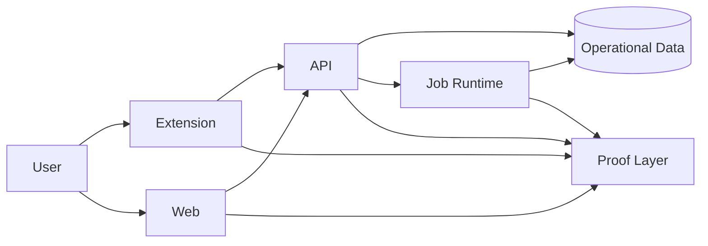

# 🚚 Sprint 1 — Deliverable 2 — Runtime

## 🧭 1. TL;DR

This deliverable creates the first **real runtime path** for SynaWeave.

The current branch already proves the governed repo foundation for that runtime path, but it does not yet prove the runtime itself. The monorepo shape, root docs spine, verifier, hooks, workflows, and reserved runtime homes now exist. D2 begins only after D1 aligns those repo controls and planning surfaces, and D2 is the first deliverable that must leave behind bootable product runtimes rather than documentation and governance structure.

This deliverable closes that gap by requiring one real end-to-end path:

1. a user authenticates
2. the extension and web surfaces resolve the same user identity
3. the user enters a real workspace shell
4. the workspace performs one backend-backed action
5. the action writes durable operational truth
6. the result is visible back through the product surface
7. the path emits measurable baselines for reliability, latency, accessibility, and future AI comparison

This deliverable is **not** a “shell only” deliverable. It is the runtime proof that later capture, practice, tutoring, graph, and learner-model work will attach to.

---

## 📌 2. Deliverable intent

Runtime exists to establish the first production-shaped system behavior.

Foundation locked:

* repository topology
* docs topology
* planning and ADR topology
* governance posture
* naming posture
* design-system posture
* secure mainline posture

Runtime must now lock:

* client runtime shape
* request-serving runtime shape
* background-job runtime shape
* authentication and session shape
* durable-write shape
* proof-baseline shape

This deliverable must be specific enough that engineers and coding agents do **not** have to infer:

* which surfaces are real
* which flows are fake
* which boundaries are public
* which boundaries are privileged
* which performance baselines matter
* which checks are required at commit, push, and pull request time

---

## 🔍 3. Repo-grounded baseline

### 📦 3.1 Historical prototype context

The historical prototype baseline was extension-first. The visible root included files such as:

* `manifest.json`
* `background.js`
* `foreground.js`
* popup and options pages
* stylesheets
* one root `README.md`

That historical context explains why D2 must prove a real runtime path instead of a shell-only scaffold. ([github.com](https://github.com/SynaWeave/SynaWeave-ce))

### 📚 3.2 Current branch reality entering D2

The current branch already describes and enforces:

* a governed monorepo with fixed runtime homes
* root `docs/` as the canonical technical documentation surface
* protected-path controls through workflows, CODEOWNERS, and verifier code
* root planning and ADR surfaces for Sprint 1

What it still does **not** prove is the runtime path itself.

The historical README described:

* selection-based card creation
* whole-page capture
* side-panel review
* local-first behavior
* spaced repetition
* TSV export

It also listed later stretch goals such as TypeScript, note deletion, integrations, text-to-speech, tags and filtering, focus mode, smart grouping, stats, translation, theme support, research suggestions, and image cards. That historical backlog is now part of the rebuild sequencing rather than a reason to reopen D1 structure. ([github.com](https://github.com/SynaWeave/SynaWeave-ce))

### 📏 3.3 What `main` does not yet prove

The current branch does **not** yet prove:

* a web control plane
* a request-serving backend
* a background job runtime
* a real authentication boundary
* durable server-owned operational truth
* one cross-surface identity path
* baseline service and UI metrics
* a DevSecOps path that blocks unsafe runtime changes at commit, push, and PR time

D2 must prove those at the narrowest honest scope.

---

## 🎯 4. Deliverable success definition

This deliverable is successful only if all of these are true:

* the extension is a real browser runtime inside the new platform shape
* the web shell is a real authenticated runtime inside the new platform shape
* the repository still has **one** README at root and **one** canonical `docs/` home at root
* there is a real request-serving backend
* there is a real run-to-completion background job
* there is one durable operational write path
* the same user identity is visible in both extension and web surfaces
* browser-safe and backend-only credential boundaries are enforced
* the runtime path has measurable baseline telemetry, performance, and quality signals
* the runtime path has enforceable test, scan, and review gates

Anything less is still a prototype shell, not a platform runtime.

---

## 🏗️ 5. Runtime contract

### 🪟 5.1 Client surfaces

This deliverable must establish two real product-facing runtime surfaces:

* the browser extension as the in-context learning client
* the web shell as the authenticated control plane

The root `docs/` folder remains the only documentation home. There must be no separate docs application or second README introduced in this deliverable.

### ⚙️ 5.2 Runtime surfaces

This deliverable must establish three real runtime surfaces:

* one request-serving application
* one background job application
* one shared authentication boundary

These surfaces must be distinct at the architecture level even if they are still small in scope.

### 🗃️ 5.3 Durable truth

This deliverable must establish the first server-owned operational truth for the rebuild.

At minimum, D2 must prove durable truth for:

* authenticated user context
* workspace or equivalent initial shell state
* one backend-backed action tied to that user context

### 👀 5.4 Proof baseline

D2 must leave the product with baseline measurements in place for:

* UI startup
* auth completion
* API latency
* API success rate
* job success and duration
* first durable action success
* extension/web continuity

These baselines are required so later features and optimizations can be compared against something real.

---

## 🧱 6. Runtime topology

### 🏗️ 6.1 Canonical topology



### 📏 6.2 Topology rules

* the extension and web surfaces must both resolve through the API boundary
* the API must own the first durable write path
* the job runtime must be independently real and not simulated through browser logic
* telemetry must exist on all four active surfaces:

  * extension
  * web
  * API
  * job runtime

### 📂 6.3 Target runtime surfaces and file/folder additions

By the end of this deliverable, the repo must have real, non-placeholder runtime homes for:

```text id="j9lpw9"
apps/
├─ extension/
├─ web/
├─ api/
└─ ingest/

packages/
├─ contracts/
├─ config/
├─ ui/
└─ tokens/

python/
├─ common/
├─ data/
└─ evaluation/

infra/
├─ docker/
├─ cloudrun/
└─ github/

docs/
├─ planning/
├─ adrs/
├─ templates/
└─ ...
```

This is a target-shape requirement, not a line-by-line file recipe. The requirement is that later runtime, ML, graph, and evaluation work have a clean home by the end of D2 rather than being forced into ad hoc directories.

---

## 🔐 7. Auth and session contract

### 🔐 7.1 Authentication model

The first runtime slice must use a browser-safe authentication model.

Supabase documents passwordless email auth and PKCE-capable server-side and browser flows, and its API key guidance is explicit that publishable or anonymous keys are safe to expose in browser contexts while secret or service-role keys are backend-only because they carry elevated privileges and can bypass row-level security. ([supabase.com](https://supabase.com/docs/guides/auth/auth-email-passwordless); [supabase.com](https://supabase.com/docs/guides/auth/server-side/advanced-guide); [supabase.com](https://supabase.com/docs/guides/api/api-keys))

### 🔐 7.2 Auth requirements

D2 must establish:

* one browser-safe sign-in path
* one session continuity path across extension and web
* one backend identity-verification path
* one durable user-scoped action after authentication

### 🔐 7.3 Credential-boundary requirements

The runtime must satisfy all of these:

* browser surfaces may only use browser-safe credentials
* backend surfaces may use privileged credentials only where required
* no privileged credential may appear in shipped extension or web assets
* browser-safe credentials must operate under row-level or equivalent access control
* the D2 path must remain compatible with future user-scoped authorization

Supabase’s row-level security guidance explicitly says elevated service keys must never be used in browsers and that service keys can bypass row-level security. ([supabase.com](https://supabase.com/docs/guides/database/postgres/row-level-security))

### 🔐 7.4 Session-continuity requirements

The same authenticated user must be able to:

* sign in
* open the extension
* open the web shell
* see consistent account context
* execute one backend-backed action

That continuity is the minimum honest proof that the platform has moved beyond an isolated extension prototype.

---

## 🪟 8. Browser runtime contract

### 🪟 8.1 MV3 runtime requirements

Chrome’s extension documentation is explicit that Manifest V3 uses an extension service worker declared in the manifest, that side panel support is a first-class extension UI surface, and that extension components communicate through the messaging APIs. ([developer.chrome.com](https://developer.chrome.com/docs/extensions/develop/concepts/service-workers/basics); [developer.chrome.com](https://developer.chrome.com/docs/extensions/reference/api/sidePanel); [developer.chrome.com](https://developer.chrome.com/docs/extensions/develop/concepts/messaging))

**D2 specification**

* the extension must use a valid MV3 runtime shape
* the side panel must be treated as a primary user-facing surface
* background behavior must live in the extension runtime model, not in a web-page substitute
* message passing must be explicit and structured
* the extension must be able to represent signed-out and signed-in states
* the extension must be able to call the real API boundary

### 🔐 8.2 Extension security requirements

Chrome’s extension security guidance emphasizes least privilege and minimal permissions. Permissions should be restricted to what the extension actually needs, and developers should avoid requesting capabilities that create unnecessary warning surfaces or attack exposure. ([developer.chrome.com](https://developer.chrome.com/docs/extensions/develop/security-privacy/stay-secure); [developer.chrome.com](https://developer.chrome.com/docs/extensions/develop/concepts/declare-permissions); [developer.chrome.com](https://developer.chrome.com/docs/extensions/develop/concepts/permission-warnings))

**D2 specification**

* requested extension permissions must be the minimum required for the D2 path
* host access must be constrained to what the D2 path needs
* no background capability may be requested merely because a later sprint might use it
* the side panel and messaging path must not rely on privileged browser access that is not justified by current scope

### 📊 8.3 Browser runtime baseline metrics

D2 must record, at minimum:

* extension install/load success rate
* side-panel open success rate
* signed-in extension-session continuity rate
* extension-to-API request success rate
* extension-side error rate for the D2 path

Targets for D2:

* extension install/load success in deterministic checks: **100%**
* side-panel open success in deterministic checks: **100%**
* extension session continuity in deterministic checks: **100%**
* extension-side error rate in D2 deterministic runs: **0 fatal errors**

---

## 🌐 9. Web runtime contract

### 🌐 9.1 Web-shell requirements

The web shell is the authenticated control plane for the first runtime slice.

**D2 specification**

* the web shell must support sign-in
* the web shell must support workspace entry
* the web shell must support one backend-backed action
* the web shell must preserve session continuity on refresh
* the web shell must reflect the same user truth as the extension

### 🌐 9.2 Performance requirements

The web shell must establish user-centric performance baselines using Core Web Vitals thresholds as the benchmark vocabulary.

Current “good” thresholds are:

* Largest Contentful Paint: **2.5 seconds or less**
* Interaction to Next Paint: **200 milliseconds or less**
* Cumulative Layout Shift: **0.1 or less** ([web.dev](https://web.dev/articles/vitals))

**D2 specification**

* the initial signed-out shell should target “good” thresholds where practical
* the initial signed-in workspace shell should record a baseline against those same thresholds
* if the web shell cannot yet meet “good” thresholds, the measured gap must be recorded as a baseline for later optimization rather than ignored

### 📊 9.3 Web runtime baseline metrics

D2 must record:

* web shell load success rate
* sign-in completion success rate
* workspace load success rate
* first backend-backed action success rate
* LCP
* INP
* CLS

Targets for D2:

* web shell load success in deterministic checks: **100%**
* sign-in completion success in deterministic checks: **100%**
* workspace load success in deterministic checks: **100%**
* backend-backed action success in deterministic checks: **100%**
* Core Web Vitals baseline recorded for the web shell: **100% coverage**

---

## ⚙️ 10. API contract

### ⚙️ 10.1 Service boundary

FastAPI is the locked request-serving application layer for the rebuild. FastAPI describes itself as a modern, high-performance Python framework with automatic OpenAPI generation and type-based development. ([fastapi.tiangolo.com](https://fastapi.tiangolo.com/))

**D2 specification**

* the API is the only public request-serving backend for D2
* the API must expose liveness and readiness behavior
* the API must verify identity
* the API must execute one durable user-scoped action
* the API must emit telemetry for all core D2 paths

### ⚙️ 10.2 API behavior requirements

The API must support at least:

* liveness
* readiness
* authenticated identity lookup
* one durable workspace or equivalent bootstrap action
* one runtime-status or capability path usable for proof and debugging

### 📏 10.3 API quality metrics

D2 must record the following API baselines:

* availability
* success rate
* p50 latency
* p95 latency
* p99 latency
* error rate
* throughput for the D2 critical path

Google’s SRE guidance treats these as standard service-level indicator categories. ([sre.google](https://sre.google/sre-book/service-level-objectives/))

### 📊 10.4 D2 API targets

* liveness route success: **100%** in deterministic checks
* readiness route success: **100%** in deterministic checks
* authenticated identity lookup success: **100%** in deterministic checks
* first durable action success: **100%** in deterministic checks
* p95 liveness latency: **< 150 ms**
* p95 readiness latency: **< 150 ms**
* p95 authenticated identity lookup latency: **< 500 ms**
* p95 first durable action latency: **< 800 ms**
* API error rate in deterministic and smoke checks: **≤ 1%**

---

## 📥 11. Background-job contract

### 📥 11.1 Job boundary

Cloud Run documentation distinguishes jobs from services by requiring jobs to run to completion and exit rather than listening for requests continuously. That is the correct model for the first bounded async path in D2. ([docs.cloud.google.com](https://docs.cloud.google.com/run/docs/create-jobs))

**D2 specification**

* one real job boundary must exist
* the job must be independently executable
* the job must be independently observable
* the job must support at least one durable write or durable validation path
* the job must be idempotent for its D2 scope

### 📥 11.2 Job baseline metrics

D2 must record:

* job start count
* job success count
* job failure count
* job p50 and p95 duration
* retry count where applicable
* idempotent rerun success

Targets for D2:

* job success in deterministic checks: **100%**
* idempotent rerun success: **100%**
* p95 duration for the bounded D2 job: **< 60 seconds**
* structured failure classification coverage: **100%**

---

## 🗃️ 12. Durable data contract

### 🗃️ 12.1 Operational truth

D2 must establish the first durable operational truth for the rebuilt platform.

That truth must be sufficient to prove:

* authenticated identity continuity
* workspace or equivalent shell continuity
* one user-scoped durable action

### 🪣 12.2 Artifact truth

If D2 requires a first artifact path, that path must remain subordinate to operational truth and must not become a hidden substitute for durable product state.

### 📏 12.3 Data requirements

The D2 data layer must satisfy all of these:

* the first runtime path writes server-owned truth
* the same truth can be read back by the platform
* browser-local state is not sufficient to close D2
* the write path is compatible with future policy enforcement
* the data model does not need to be redesigned immediately in Sprint 2

### 📊 12.4 Data baseline metrics

D2 must record:

* durable write success rate
* durable read-back success rate
* workspace bootstrap success rate
* identity-to-workspace continuity success rate

Targets:

* durable write success: **100%** in deterministic checks
* durable read-back success: **100%** in deterministic checks
* workspace bootstrap success: **100%** in deterministic checks

---

## 👀 13. Observability and proof contract

### 👀 13.1 Why D2 needs proof

D2 must leave behind baselines that later work can compare against.

OpenTelemetry’s documentation frames observability as the ability to understand a system from the outside using telemetry such as traces, metrics, and logs. This means D2 cannot wait until later to decide what should be measured. ([opentelemetry.io](https://opentelemetry.io/docs/concepts/observability-primer/))

### 👀 13.2 D2 proof scope

D2 must establish baseline proof for:

* extension shell
* web shell
* API
* background job
* auth flow
* first durable action
* first cross-surface continuity path

### 👀 13.3 Required D2 telemetry categories

D2 must produce at least these telemetry categories:

* traces for core runtime paths
* metrics for core runtime paths
* structured logs for backend runtime paths
* one AI-ready or future-AI-ready trace path for comparison later

### 📊 13.4 Required D2 metrics

#### Extension and web

* install/load success
* side-panel open success
* sign-in success
* workspace entry success
* first interactive path success

#### API

* liveness success
* readiness success
* authenticated identity lookup success
* first durable action success
* latency percentiles
* error rate

#### Job

* job success
* job duration
* retry count
* idempotent rerun success

#### Performance

* LCP
* INP
* CLS
* side-panel open timing
* first durable action timing
* job completion timing

#### Security

* browser secret leakage count
* privileged-key browser exposure count
* auth continuity failure count

### 📏 13.5 D2 proof-quality requirements

D2 proof is valid only if:

* metrics are tied to the real D2 path
* traces cover the real D2 path
* errors are classified
* success is measured, not assumed
* performance baselines are recorded before later optimization work begins

---

## ✅ 14. Testing contract

### ✅ 14.1 Required test layers

The following layers are mandatory for D2:

* unit
* component
* integration
* contract
* UI
* end-to-end
* security
* performance
* accessibility
* evaluation placeholder

### 🧪 14.2 Browser and shell verification

Playwright is the browser automation baseline, and Playwright explicitly supports extension testing in Chromium using persistent context-based setups. ([playwright.dev](https://playwright.dev/docs/chrome-extensions))

**D2 specification**

* extension install/load must have deterministic verification
* side-panel open must have deterministic verification
* web shell sign-in path must have deterministic verification
* the full signed-in D2 path must have smoke coverage

### ♿ 14.3 Accessibility verification

Playwright recommends integrating Axe for accessibility testing, and its accessibility guidance explicitly points to `@axe-core/playwright` for automated accessibility checks. ([playwright.dev](https://playwright.dev/docs/accessibility-testing))

**D2 specification**

* the web shell must have accessibility checks
* the side panel must have accessibility checks
* critical accessibility blockers on D2 shell surfaces must be zero at exit

### 🔐 14.4 Security verification

D2 security checks must cover:

* browser-safe credential boundaries
* absence of privileged credentials in browser artifacts
* session continuity without privilege leakage
* safe handling of auth tokens and browser-managed session state
* future compatibility with user-scoped access controls

### ⚡ 14.5 Performance verification

Performance verification must cover:

* extension shell startup
* side-panel open
* web shell load
* authenticated action latency
* job execution duration

### 📏 14.6 Quantitative test thresholds

* deterministic extension shell success: **100%**
* deterministic side-panel success: **100%**
* deterministic sign-in success: **100%**
* deterministic first durable action success: **100%**
* smoke coverage for the full D2 path: **present and passing**
* critical accessibility blocker count on D2 shell surfaces: **0**
* privileged-key exposure count in browser outputs: **0**
* baseline performance metric coverage: **100% for D2 critical path**

---

## 🔐 15. Hooks, repo controls, and DevSecOps enforcement

### 🧱 15.1 Commit-time controls

Commit-time controls must enforce:

* formatting
* linting where configured
* fast type checking where configured
* local secret and config hygiene checks where configured
* Foundation’s commit-subject rules

### 🔗 15.2 Push-time controls

Push-time controls must enforce:

* broader type checks
* broader tests for the touched D2 surfaces
* configuration validation where relevant
* failure on obvious secret or credential exposure
* failure on missing required D2 proof prerequisites

### 🐙 15.3 Pull-request controls

Pull-request controls must enforce:

* required status checks
* code scanning
* dependency review
* visible pass/fail for D2 path verification
* docs alignment checks for runtime changes
* branch protection against direct low-signal merge

### 🔐 15.4 Security controls baseline

GitHub documents:

* CodeQL for code scanning
* dependency review for pull-request dependency-risk checks
* secret scanning for supported credentials across repository history
* push protection for blocking supported secrets before push. ([docs.github.com](https://docs.github.com/code-security/code-scanning/introduction-to-code-scanning/about-code-scanning-with-codeql?utm_source=chatgpt.com); [docs.github.com](https://docs.github.com/code-security/supply-chain-security/understanding-your-software-supply-chain/about-dependency-review?utm_source=chatgpt.com); [docs.github.com](https://docs.github.com/code-security/secret-scanning/about-secret-scanning?utm_source=chatgpt.com); [docs.github.com](https://docs.github.com/en/code-security/concepts/secret-security/about-push-protection?utm_source=chatgpt.com))

**D2 specification**

* all four controls must be part of the repo path to `main`
* none of them may be deferred as “later hardening”

### 📏 15.5 Repo-control acceptance

D2 is not complete unless:

* commit controls exist
* push controls exist
* PR controls exist
* runtime and security regressions can be blocked before merge
* coding-agent-produced code is subject to the same controls as human-produced code

---

## 🔀 16. Safe parallel workstreams

### 🔗 16.1 Serial truths that must freeze first

These must stabilize before broader parallel execution:

1. the D2 runtime contract
2. the D2 auth and credential-boundary contract
3. the one-README and root-docs rule
4. the D2 proof baseline categories
5. the D2 test-layer expectations

### 🔀 16.2 Safe parallel workstreams after the freeze

#### 🪟 Workstream A — extension shell

Owns:

* extension runtime shell
* side-panel shell
* signed-in and signed-out shell states
* browser-safe session handling

#### 🌐 Workstream B — web shell

Owns:

* sign-in route
* workspace shell
* signed-in continuity
* first web-side backend-backed action

#### ⚙️ Workstream C — API and auth

Owns:

* API boundary
* identity verification
* durable action boundary
* readiness/liveness behavior
* browser-safe versus backend-only credential separation

#### 📥 Workstream D — job and data

Owns:

* background job
* first durable write or durable validation path
* local-production-like stack boot
* durable operational truth continuity

#### 👀 Workstream E — proof and controls

Owns:

* telemetry baseline
* performance baseline
* browser automation
* accessibility and security verification
* commit/push/PR enforcement

### 🚫 16.3 Unsafe parallelism

Do not split these independently:

* extension and web auth behavior before the auth contract is frozen
* API readiness and job semantics before the runtime contract is frozen
* proof-baseline metrics and route/state meaning at the same time
* verification ownership for the same D2 path across multiple lanes without one declared owner

### 📏 16.4 Parallel handoff order

```text id="l4z1b6"
runtime + auth freeze
        ↓
proof + verification freeze
        ↓
parallel workstreams A–E
        ↓
cross-surface validation
        ↓
D2 closeout
```

---

## 🎟️ 17. Ticket breakdown

These are the **work-package tickets** for Runtime. They are not line-by-line coding tasks.

### 🎟️ 17.1 Ticket 0 — Runtime contract freeze

Purpose:

* freeze the D2 runtime shape so all later tickets build the same path

Must decide:

* the exact D2 user path
* the exact runtime surfaces
* the exact browser-safe versus backend-only credential rule
* the exact durable truth boundary
* the exact baseline metrics categories

Blocks:

* all other tickets

### 🎟️ 17.2 Ticket 1 — Extension shell

Purpose:

* establish the first real browser-native product shell

Must prove:

* MV3-compliant runtime shape
* side-panel behavior
* signed-in and signed-out shell states
* browser-safe session continuity
* API reachability from the extension

Depends on:

* Ticket 0

### 🎟️ 17.3 Ticket 2 — Web shell

Purpose:

* establish the first real authenticated web control-plane shell

Must prove:

* sign-in
* signed-in workspace shell
* session continuity on refresh
* one backend-backed web action
* web-shell baseline performance

Depends on:

* Ticket 0

### 🎟️ 17.4 Ticket 3 — API and auth boundary

Purpose:

* establish the first request-serving platform boundary

Must prove:

* liveness
* readiness
* identity verification
* one durable action
* correct credential separation
* measurable API baselines

Depends on:

* Ticket 0

### 🎟️ 17.5 Ticket 4 — Job and durable truth

Purpose:

* establish the first real background execution path and durable write proof

Must prove:

* one real job boundary
* one idempotent job path
* one durable operational truth write and read-back path
* one local-production-like stack proof

Depends on:

* Tickets 0 and 3

### 🎟️ 17.6 Ticket 5 — Proof baseline

Purpose:

* establish the first measurable runtime baseline

Must prove:

* traces
* metrics
* performance baselines
* security baseline signals
* AI-ready trace baseline
* comparison-ready benchmark record for later work

Depends on:

* Tickets 0 through 4

### 🎟️ 17.7 Ticket 6 — Verification and controls

Purpose:

* establish the first full test and DevSecOps enforcement path for the D2 runtime slice

Must prove:

* required test layers
* browser automation
* accessibility checks
* security checks
* commit, push, and PR controls
* merge-blocking quality posture

Depends on:

* Tickets 0 through 5

### 🎟️ 17.8 Ticket 7 — D2 closeout

Purpose:

* prove that the first runtime path is real, measurable, and handoff-ready for Sprint 2

Must prove:

* all D2 exit criteria
* all D2 quantitative thresholds
* a clean handoff to later feature work
* a comparison-ready proof baseline

Depends on:

* all prior tickets

---

## 📦 18. Target file and folder additions or refactors

By the end of D2, the following runtime-facing surfaces must have real homes in the repo shape:

```text id="hrd4ne"
apps/
├─ extension/
├─ web/
├─ api/
└─ ingest/

packages/
├─ contracts/
├─ config/
├─ ui/
└─ tokens/

python/
├─ common/
├─ data/
└─ evaluation/

infra/
├─ docker/
├─ cloudrun/
└─ github/

docs/
├─ planning/
├─ adrs/
├─ templates/
└─ ...
```

**Rules**

* root `docs/` remains the only canonical docs home
* no separate docs application is introduced
* only one root README exists
* every added or refactored top-level domain must clearly support later work
* the D2 repo must already be fleshed out enough that Sprint 2 does not need to reopen topology questions

---

## 📊 19. D2 baseline metrics for future optimization narratives

D2 must record enough measurement that later improvements can be stated quantitatively.

These are the baseline metrics that later sprints should compare against.

### 👤 19.1 User-path metrics

* sign-in completion rate
* workspace entry success rate
* first backend-backed action success rate
* cross-surface continuity success rate

### ⚙️ 19.2 Service metrics

* API availability
* API success rate
* API p50 / p95 / p99 latency
* job success rate
* job p50 / p95 duration

### 🌐 19.3 UI performance metrics

* LCP
* INP
* CLS
* side-panel open timing
* first meaningful shell render timing

### 🔐 19.4 Security metrics

* secret leakage count
* browser privileged-key exposure count
* auth continuity failure count

### 👀 19.5 Proof metrics

* telemetry coverage of the D2 critical path
* baseline trace coverage
* baseline metric coverage
* baseline AI-ready trace coverage

These are the metrics that later product pitches, optimization narratives, and engineering comparisons should build on.

---

## ✅ 20. Exit criteria

D2 is complete only when all of the following are true.

### ✅ 20.1 Runtime

* [ ] extension shell is real
* [ ] web shell is real
* [ ] request-serving backend is real
* [ ] background job runtime is real
* [ ] root `docs/` remains the only docs home
* [ ] only one README exists at root

### ✅ 20.2 Identity and durability

* [ ] a user can authenticate
* [ ] the same user context is visible in extension and web shells
* [ ] one backend-backed action exists
* [ ] that action writes durable truth
* [ ] the same truth is visible back through the product path

### ✅ 20.3 Security and trust

* [ ] browser surfaces use only browser-safe credentials
* [ ] no privileged credential is shipped in browser assets
* [ ] the first durable action is compatible with future user-scoped access control
* [ ] secret leakage count is zero

### ✅ 20.4 Proof

* [ ] baseline telemetry exists
* [ ] baseline metrics exist
* [ ] baseline performance is recorded
* [ ] baseline API and job metrics are recorded
* [ ] baseline auth metrics are recorded
* [ ] one AI-ready trace path exists

### ✅ 20.5 Verification

* [ ] required D2 test layers exist
* [ ] extension/browser automation exists
* [ ] accessibility checks exist
* [ ] security checks exist
* [ ] performance checks exist
* [ ] commit, push, and PR controls are active

### ✅ 20.6 Quantitative thresholds

* [ ] extension load success = 100%
* [ ] side-panel open success = 100%
* [ ] sign-in completion success = 100%
* [ ] first durable action success = 100%
* [ ] job success = 100%
* [ ] browser privileged-key exposure count = 0
* [ ] critical accessibility blocker count = 0
* [ ] D2 critical-path metric coverage = 100%
* [ ] D2 handoff ambiguity count = 0

---

## ❌ 21. Failure conditions

D2 fails if any of these remain true:

* the runtime path is still mostly shell-only
* the browser and web surfaces do not converge on the same identity truth
* the durable write path is fake or browser-local
* the job boundary is nominal rather than real
* there is no measurable baseline for reliability or performance
* there is no enforceable DevSecOps path for the D2 surfaces
* the repo introduces a second docs home or a second README
* Sprint 2 would still need to reinterpret what the first real runtime path means

---

## ✅ 22. Acceptance standard

This packet is correct only if a mid-level, senior, or staff engineer can answer all of these without consulting lower-level documents:

* What exact runtime path is D2 proving?
* What standards and industry baselines define the D2 security and quality posture?
* What metrics will exist so later runtime, AI, and product improvements are comparable?
* What are the commit, push, and PR controls that enforce safe D2 work?
* How can five engineers work in parallel safely?
* What concrete measurable thresholds determine whether D2 is complete?
* What file and folder domains must exist by the end so the repo is ready for what comes after?

If those answers are not explicit after reading this packet, the D2 Runtime deliverable spec is incomplete.
