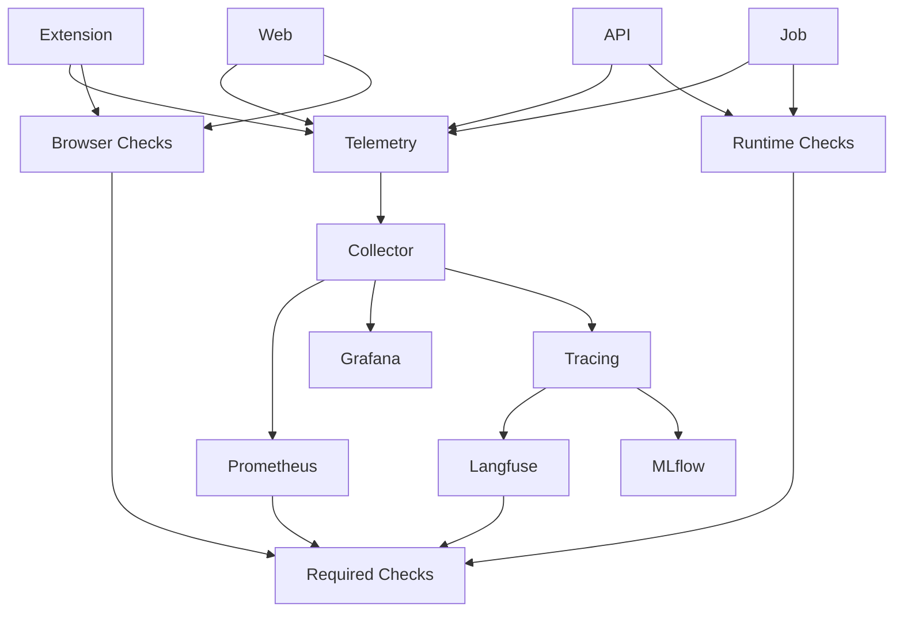

# 🚚 Sprint 1 — Deliverable 3 — Quality

## 1. 🧭 TL;DR

This deliverable turns the first runtime path from “working” into “measurable, enforceable, and safe to build on.”

The purpose of D3 is not to add broad new product scope. Its purpose is to establish the permanent **quality system** for the rebuilt platform. That system must cover:

* observability
* evaluation
* accessibility
* performance
* security
* supply chain controls
* branch protection
* automated verification
* release-readiness evidence

OpenTelemetry is the locked telemetry standard for traces, metrics, and logs, and the Collector is the required routing layer because it receives, processes, and exports telemetry through pipelines. Prometheus is the locked metrics and alerting baseline, Grafana is the locked dashboard baseline, Langfuse is the locked product-facing AI trace and online evaluation baseline, MLflow is the locked offline experiment and offline evaluation baseline, and GitHub’s code scanning, dependency review, secret scanning, and protected-branch capabilities are the locked source-control quality baseline. Playwright plus Axe is the locked browser-side accessibility baseline. ([opentelemetry.io](https://opentelemetry.io/docs/concepts/observability-primer/); [opentelemetry.io](https://opentelemetry.io/docs/collector/architecture/); [prometheus.io](https://prometheus.io/docs/introduction/overview/); [grafana.com](https://grafana.com/docs/grafana/latest/fundamentals/dashboards-overview/); [langfuse.com](https://langfuse.com/docs/evaluation/overview); [docs.github.com](https://docs.github.com/code-security/code-scanning/introduction-to-code-scanning/about-code-scanning-with-codeql); [playwright.dev](https://playwright.dev/docs/accessibility-testing))

D3 is complete only when:

* the D2 runtime path is traceable end to end
* critical-path metrics are exported and visible
* accessibility, security, and supply-chain gates are enforceable
* baseline performance numbers are recorded against user-centric standards
* at least one AI-ready flow is traced and evaluated
* the repository blocks unsafe changes at commit, push, and pull request time

Current bounded closeout snapshot:

* collector-routed API and ingest telemetry is locally reproducible
* schema-driven contract tests cover the shared public runtime interfaces
* browser proof records web-shell Core Web Vitals and explicit side-panel proof limits in a tracked artifact
* hosted GitHub ruleset enforcement and managed observability backends remain external confirmation points

---

## 2. 📌 Deliverable intent

D3 exists to remove **quality ambiguity**.

After D2, the platform has one real runtime path. Without D3, later sprints would still be guessing about:

* what “good” performance means
* what “reliable” means
* what “secure enough to merge” means
* what “grounded AI quality” means
* what “accessible enough to ship” means
* what telemetry must exist before new features are added

This deliverable freezes those rules and makes them executable.

---

## 3. 🔍 Repo-grounded baseline

### 3.1 📦 Current baseline entering D3

D3 begins after:

* D1 has established the repository, docs, governance, and quality-gate foundation
* D2 has established the first real runtime path

That means D3 is not inventing quality from scratch. It is attaching measurable and enforceable quality to the runtime surfaces already introduced:

* extension
* web
* API
* job runtime

### 3.2 📏 Why D3 is required now

If observability, evaluation, accessibility, performance baselines, and security controls are not established now, then:

* later claims about improvement will not be comparable
* later AI features will not have a clean proof baseline
* later regressions will be harder to diagnose
* later product claims will outrun the actual evidence

This is exactly why OpenTelemetry’s observability guidance emphasizes understanding system behavior from the outside through telemetry, and why Langfuse and MLflow make repeatable online and offline evaluation visible instead of leaving quality to intuition. ([opentelemetry.io](https://opentelemetry.io/docs/concepts/observability-primer/); [langfuse.com](https://langfuse.com/docs/evaluation/overview))

---

## 4. 🎯 Deliverable success definition

D3 is successful only if all of the following are true:

* every D2 runtime surface emits telemetry
* the D2 critical path can be followed end to end
* structured backend logs are correlated with traces
* critical metrics are exported and queryable
* dashboards exist for the core runtime path
* browser and extension shells have automated accessibility checks
* core runtime security and supply-chain checks block unsafe changes
* baseline performance numbers are recorded using user-centric web and runtime metrics
* one AI-ready path is traced and scored
* the repository enforces these standards at commit, push, and pull request time

If any one of those remains aspirational instead of real, D3 is incomplete.

---

## 5. 🧱 Quality model

D3 defines one quality model for the whole platform.

That model has five dimensions:

* runtime quality
* user-facing quality
* AI quality
* trust and security quality
* repository and delivery quality

A feature or runtime path is not “good” because it works in one narrow happy-path case. It is only considered “good” when the relevant quality dimensions are measurable and passing.

---

## 6. 🏗️ Quality system diagram



Interpretation:

* all runtime surfaces emit telemetry
* the Collector is the fan-out point
* Prometheus and Grafana provide operational visibility
* Langfuse provides AI-facing online visibility
* MLflow provides offline experiment and evaluation visibility
* browser, runtime, and AI checks all converge into required merge gates

---

## 7. 🔒 Frozen decisions

This section locks the D3 decisions that later sprints must inherit.

### 7.1 👀 Telemetry standard

**Decision**
OpenTelemetry is the one telemetry standard for runtime instrumentation, and the OpenTelemetry Collector is mandatory for routing telemetry.

**Why**
OpenTelemetry is explicitly vendor-neutral and supports traces, metrics, and logs. The Collector is explicitly designed to receive, process, and export telemetry to one or more backends through configured pipelines. That makes it the correct durable foundation for a product that intends to remain provider-flexible and observability-heavy. ([opentelemetry.io](https://opentelemetry.io/docs/); [opentelemetry.io](https://opentelemetry.io/docs/collector/configuration/))

**Specification**

* every production-facing runtime surface must emit telemetry through the same observability standard
* all runtime telemetry must pass through one Collector-controlled routing layer
* direct one-off exporter wiring that bypasses the Collector is not acceptable for the D3 baseline unless explicitly justified as a temporary exception

### 7.2 📊 Metrics and dashboard standard

**Decision**
Prometheus and Grafana are the default metrics and dashboard layer.

**Why**
Prometheus provides a dimensional time-series model, a query language, and alerting primitives. Grafana provides the dashboard layer that queries and visualizes operational data. This is a strong and standard observability pairing for product and runtime systems. ([prometheus.io](https://prometheus.io/docs/introduction/overview/); [grafana.com](https://grafana.com/docs/grafana/latest/fundamentals/dashboards-overview/))

**Specification**

* critical-path runtime metrics must be exported in Prometheus-compatible form
* critical dashboards must exist in Grafana rather than only in ad hoc local tooling
* dashboards must be versioned artifacts, not only manual UI configuration

### 7.3 🤖 AI trace and evaluation standard

**Decision**
Langfuse is the product-facing AI trace and online evaluation layer.

**Why**
Langfuse is specifically built for LLM observability, prompt management, evaluations, scoring, experiments, and production monitoring. It is therefore the right system for product-facing AI traces and online AI quality rather than forcing those concerns into generic runtime-only telemetry. ([langfuse.com](https://langfuse.com/docs); [langfuse.com](https://langfuse.com/docs/evaluation/core-concepts))

**Specification**

* at least one AI-ready flow must emit a Langfuse trace
* at least one evaluative score must exist in the D3 proof path
* later tutor and retrieval features must attach to the same online evaluation home instead of inventing a second product-facing AI proof stack

### 7.4 🧪 Offline experiment and evaluation standard

**Decision**
MLflow is the offline experiment, offline evaluation, and model lifecycle layer.

**Why**
The platform needs one durable home for experiment tracking, batch comparison, model lineage, and offline evaluation evidence that is separate from product-facing traces. MLflow fills that role without overloading runtime telemetry or product analytics.

**Specification**

* offline model and prompt experiments must attach to MLflow instead of ad hoc spreadsheets or local notebooks
* later evaluation work must keep online evaluation in Langfuse and offline experiment evidence in MLflow
* D3 proof material must show which evidence came from product-facing traces versus offline experiment runs

### 7.5 🐙 Branch and merge quality standard

**Decision**
Default-branch merge enforcement is rulesets-first on GitHub, while the repository documents the exact hosted check names and ownership posture it expects those rulesets to enforce.

**Why**
GitHub’s branch-protection and ruleset model is the real enforcement home for required statuses, stale approvals, and CODEOWNERS review posture. The repo still needs exact workflow names and ownership files checked in, but it should not pretend those files alone prove hosted merge blocking. ([docs.github.com](https://docs.github.com/en/repositories/configuring-branches-and-merges-in-your-repository/managing-protected-branches/about-protected-branches); [docs.github.com](https://docs.github.com/en/repositories/configuring-branches-and-merges-in-your-repository/managing-rulesets/about-rulesets))

**Specification**

* repo docs must name the hosted required-check statuses exactly as workflows emit them
* GitHub rulesets are the first enforcement home for pull-request requirements, required statuses, stale approvals, and any merge-blocking CODEOWNERS review requirement
* local success is not sufficient if PR checks fail or configured GitHub rulesets reject the change

### 7.6 🔐 Code scanning standard

**Decision**
CodeQL is mandatory for code scanning.

**Why**
GitHub documents CodeQL as its code-analysis engine for identifying vulnerabilities and coding errors and explicitly makes it available for public repositories. ([docs.github.com](https://docs.github.com/code-security/code-scanning/introduction-to-code-scanning/about-code-scanning-with-codeql))

**Specification**

* at least one successful CodeQL scan on the default branch must exist
* CodeQL must continue to run on subsequent changes according to the repository workflow policy
* code-scanning failures on the default path are merge-blocking unless explicitly exempted

### 7.7 📦 Dependency review standard

**Decision**
Dependency review is mandatory for pull requests.

**Why**
GitHub’s dependency-review documentation states that it scans pull requests for dependency changes and can raise an error if new vulnerable dependencies are introduced. This is the correct minimum supply-chain control for a public codebase that will accumulate multiple language ecosystems. ([docs.github.com](https://docs.github.com/en/code-security/how-tos/secure-your-supply-chain/manage-your-dependency-security/configuring-the-dependency-review-action))

**Specification**

* pull requests that change dependencies must run dependency review
* vulnerable or disallowed dependency changes must be able to fail the PR
* dependency review must remain part of the D3 merge baseline

### 7.8 🔐 Secret protection standard

**Decision**
Secret scanning and push protection are part of the baseline.

**Why**
GitHub documents secret scanning for supported secrets and push protection for blocking supported secrets before they land in the repository. Those must be active for a product that handles credentials and infrastructure configuration. ([docs.github.com](https://docs.github.com/code-security/secret-scanning/about-secret-scanning); [docs.github.com](https://docs.github.com/en/code-security/concepts/secret-security/about-push-protection))

**Specification**

* secret scanning must be enabled
* push protection must be enabled where available
* no D3-closeout claim is valid if supported secrets can still enter the mainline path unblocked

### 7.9 ♿ Accessibility standard

**Decision**
Playwright with Axe is the automated accessibility baseline.

**Why**
Playwright explicitly documents accessibility testing with `@axe-core/playwright`, and also makes clear that its old accessibility API was removed and Axe should be used instead. ([playwright.dev](https://playwright.dev/docs/accessibility-testing); [playwright.dev](https://playwright.dev/docs/release-notes))

**Specification**

* web shell accessibility checks are mandatory
* side-panel accessibility checks are mandatory
* critical accessibility blockers must be zero on the D3 runtime path

### 7.9 ⚡ Performance standard

**Decision**
The platform uses user-centric web performance metrics and SRE-style runtime metrics as its D3 performance baseline.

**Why**
Core Web Vitals remain the standard vocabulary for page-level user experience, with good thresholds for LCP, INP, and CLS. Google also recommends evaluating these metrics at the 75th percentile of page visits. For service and job surfaces, SRE-style latency, success, and throughput metrics are the correct standard language. ([web.dev](https://web.dev/articles/vitals); [web.dev](https://web.dev/articles/defining-core-web-vitals-thresholds); [web.dev](https://web.dev/articles/vitals-measurement-getting-started); [sre.google](https://sre.google/sre-book/service-level-objectives/))

**Specification**

* web-shell and browser-shell performance must be measured with user-centric metrics
* service and job performance must be measured with service-oriented metrics
* D3 must record baseline values even where later sprints are expected to improve them

---

## 8. 📂 Target files and folders added or refactored

By the end of D3, the following classes of files and directories must exist or be materially upgraded.

### 8.1 👀 Observability surfaces

```text id="u6h4ea"
infra/
├─ observability/
│  ├─ collector/
│  ├─ dashboards/
│  └─ alerts/

apps/
├─ api/
├─ ingest/
├─ extension/
└─ web/

testing/
├─ performance/
├─ accessibility/
└─ evals/
```

### 8.2 🐙 Quality-control surfaces

```text id="m5wz1a"
.github/
└─ workflows/
   ├─ ci-...
   ├─ codeql-...
   ├─ dependency-review-...
   ├─ docs-...
   └─ quality-...
```

### 8.3 📚 Docs surfaces

The canonical documentation home remains the root `docs/` folder. D3 must update and strengthen at least:

```text id="rbn3ui"
docs/
├─ testing.md
├─ operations.md
├─ architecture.md
├─ infra.md
└─ planning/
   └─ sprint-001/
      └─ d3-quality.md
```

### 8.4 📏 Structural requirements

* no new second documentation home may be introduced
* no second README may be introduced
* quality and observability artifacts must have stable homes
* dashboards and alerting artifacts must be version-controlled
* test and proof surfaces must remain discoverable at the repo root level

---

## 🔀 9. Safe parallel workstreams

D3 supports a five-engineer team, but only after a few serial truths are frozen.

### 🔗 9.1 Serial truths that must freeze first

The following must stabilize before broad parallel work begins:

1. the D3 proof-stack contract
2. the D3 metrics families
3. the D3 required checks set
4. the D3 performance baseline model
5. the D3 accessibility baseline model

### 🔀 9.2 Safe parallel workstreams after the freeze

#### 👀 Workstream A — runtime instrumentation

Owns:

* extension instrumentation
* web instrumentation
* API instrumentation
* job instrumentation
* Collector plumbing

#### 📊 Workstream B — metrics, dashboards, and alerting

Owns:

* metric definitions
* dashboard artifacts
* alerting rules
* SLI/SLO baseline artifacts
* baseline comparison views

#### ✅ Workstream C — browser, accessibility, and UI proof

Owns:

* browser automation
* shell verification
* accessibility scans
* UI smoke and deterministic coverage
* browser-side baseline performance capture

#### 🔐 Workstream D — security and supply-chain controls

Owns:

* CodeQL
* dependency review
* secret scanning
* push protection
* branch-protection configuration
* secure review posture

#### 🤖 Workstream E — AI proof and evaluation baseline

Owns:

* Langfuse baseline
* AI-ready trace
* evaluation placeholder
* future tutor/retrieval evaluation compatibility
* cost and score baselines

### 🚫 9.3 Unsafe parallelism

The following should not be split independently:

* different teams defining different telemetry semantics for the same D2 path
* different teams creating separate dashboard vocabularies for the same runtime path
* browser checks and accessibility checks for the same surfaces without one owner
* AI proof work inventing separate trace or score models from the main observability design
* multiple teams editing the same workflow and branch-protection surfaces without one declared owner

### 📏 9.4 Safe handoff order

```text id="cnl4pv"
proof contract freeze
        ↓
metrics + check-set freeze
        ↓
parallel workstreams A–E
        ↓
cross-validation
        ↓
D3 closeout
```

---

## 🎟️ 10. Ticket breakdown

These tickets are the execution-grade work packages for D3. They are not line-by-line implementation tasks, but they are narrow enough that no major decision is left implicit.

### 🎟️ 10.1 Ticket 0 — Quality contract freeze

**Purpose**
Freeze the D3 quality model before instrumentation or tests expand.

**Must decide**

* proof-stack ownership
* metric families
* required checks
* browser/accessibility baseline
* performance baseline vocabulary
* AI evaluation baseline vocabulary

**Must produce**

* one canonical D3 quality model
* one canonical D3 evidence model

**Blocks**

* all other D3 tickets

---

### 🎟️ 10.2 Ticket 1 — Runtime instrumentation and structured telemetry

**Purpose**
Instrument the extension, web shell, API, and job runtime so the D2 path becomes traceable and measurable.

**Must prove**

* all four runtime surfaces emit telemetry
* the D2 path can be followed end to end
* the Collector receives telemetry and routes it correctly
* backend logs are structured and correlated to request or job context
* the platform is using one telemetry standard, not multiple ad hoc ones

**Depends on**

* Ticket 0

**Target surfaces**

* extension runtime
* web runtime
* request-serving service
* background job
* Collector configuration
* log correlation layer

**Quantified outputs**

* critical-path telemetry coverage: **100%**
* critical-path trace continuity across runtime boundaries: **100%**
* structured-log coverage for API and job critical path: **100%**

---

### 🎟️ 10.3 Ticket 2 — Metrics, dashboards, and alerting

**Purpose**
Establish the first durable metrics and dashboard baseline and make symptom-focused alerting possible.

Prometheus recommends alerting on symptoms associated with end-user pain and allowing slack for small blips instead of trying to alert on every possible internal failure mode. ([prometheus.io](https://prometheus.io/docs/practices/alerting/))

**Must prove**

* critical-path metrics are exported
* dashboards exist for the D2 path
* alerting rules exist for the most important symptoms
* metrics are dimensioned clearly enough to compare later sprint changes

**Depends on**

* Ticket 0
* Ticket 1

**Required dashboard families**

* runtime health
* product critical path
* auth and session path
* job execution
* latency and error rates
* AI-ready or evaluation path

**Required alert families**

* API liveness failure
* API readiness failure
* critical-path error-rate regression
* job failure
* missing or broken telemetry on the D2 path

**Quantified outputs**

* dashboard coverage for D2 critical path: **100%**
* alert coverage for top D2 symptom classes: **100%**
* metrics export coverage for D2 critical endpoints and jobs: **100%**

---

### 🎟️ 10.4 Ticket 3 — Browser proof, accessibility, and UI quality baseline

**Purpose**
Turn the first runtime path into a repeatable browser-verified and accessibility-verified path.

**Must prove**

* extension install/load automation
* side-panel open automation
* signed-in web-shell automation
* core D2 end-to-end smoke path
* accessibility scans for the signed-in shell and side panel
* browser-side performance baseline capture

**Depends on**

* Ticket 0
* Ticket 1

**Required browser proof surfaces**

* extension load
* side-panel open
* web shell load
* sign-in flow
* first backend-backed action

**Required accessibility scope**

* web shell
* workspace shell
* extension side panel

**Quantified outputs**

* deterministic browser success on D2 core path: **100%**
* smoke success on the D2 end-to-end path: **100%**
* critical accessibility blocker count on D2 shell surfaces: **0**
* browser-side performance-baseline coverage for D2 shell surfaces: **100%**

---

### 🎟️ 10.5 Ticket 4 — Security, supply chain, and branch-control enforcement

**Purpose**
Make the repository enforce safe and reviewable changes instead of relying on developer discipline.

**Must prove**

* CodeQL is active
* dependency review is active
* secret scanning is active
* push protection is active where supported
* commit, push, and PR controls enforce the D3 quality contract
* required status checks are merge-blocking

**Depends on**

* Ticket 0

**Required enforcement surfaces**

* commit path
* push path
* pull request path
* default-branch merge path

**Quantified outputs**

* successful CodeQL scan on default branch: **at least 1**
* successful dependency-review execution on PR path: **at least 1**
* secret scanning status: **enabled**
* push-protection status: **enabled where supported**
* required-check set completeness against D3 policy: **100%**
* merge-blocking enforcement for required checks: **100%**

---

### 🎟️ 10.6 Ticket 5 — Performance and comparison baseline

**Purpose**
Create the first durable performance baseline for the runtime path so later optimizations are measurable.

**Must prove**

* baseline Core Web Vitals for the web shell
* baseline side-panel timing
* baseline API latency
* baseline job duration
* baseline throughput and success-rate measurements
* one comparison-ready snapshot of D2 performance

**Depends on**

* Ticket 0
* Ticket 1
* Ticket 2
* Ticket 3

**Required performance baselines**

* LCP
* INP
* CLS
* side-panel open timing
* authenticated workspace entry timing
* first durable-action timing
* API p50 / p95 / p99 latency
* job p50 / p95 duration

**Quantified outputs**

* performance-baseline coverage of D2 critical path: **100%**
* Core Web Vitals measurement coverage of web shell: **100%**
* latency-baseline coverage of API critical path: **100%**
* duration-baseline coverage of job critical path: **100%**

---

### 🎟️ 10.7 Ticket 6 — AI-ready proof and evaluation baseline

**Purpose**
Establish the first AI proof surface so later tutor, retrieval, and learner-model work has a stable comparison baseline.

**Must prove**

* one Langfuse-backed trace path
* one AI-ready scored or annotated outcome
* one future-compatible evaluation home
* one future-compatible cost baseline
* one future-compatible prompt or trace namespace

**Depends on**

* Ticket 0
* Ticket 1
* Ticket 2

**Required AI proof categories**

* online trace
* score or evaluation result
* cost-aware record
* future retrieval/tutor compatibility

**Quantified outputs**

* AI-ready trace coverage for at least one D2-adjacent flow: **100%**
* AI-ready score or evaluation coverage for that flow: **100%**
* future tutor/retrieval evaluation compatibility: **established and documented**
* AI-ready cost baseline presence: **100%**

---

### 🎟️ 10.8 Ticket 7 — D3 closeout and release-quality handoff

**Purpose**
Prove that the first runtime path is now measurable, enforceable, and safe to build on.

**Must prove**

* all D3 metrics and checks exist
* all D3 thresholds are recorded
* all required docs and proof artifacts are updated
* all later sprints can compare against D3 baselines
* the quality system does not need to be reinvented in later work

**Depends on**

* all prior tickets

**Quantified outputs**

* D3 evidence completeness: **100%**
* D3 baseline metric coverage: **100%**
* D3 handoff ambiguity count: **0**

---

## 📊 11. Evidence contract

### 🧪 11.1 Evidence types

Use these evidence types for D3:

* deterministic
* smoke
* configuration
* review
* baseline

### 📦 11.2 Evidence matrix

| Criterion                                               | Evidence type            | Required proof                                              |
| ------------------------------------------------------- | ------------------------ | ----------------------------------------------------------- |
| Critical-path runtime surfaces emit telemetry           | deterministic            | instrumentation verification across all D2 runtime surfaces |
| Collector receives and routes telemetry                 | deterministic            | collector and exporter verification                         |
| Critical metrics are exported                           | deterministic            | metric scrape/export verification                           |
| Dashboards exist for all required families              | review + deterministic   | dashboard artifact review plus live query proof             |
| Alert rules exist for top symptom classes               | configuration + review   | alert artifact review and rule evaluation proof             |
| Browser and web shell path is automated                 | deterministic + smoke    | Playwright proof                                            |
| Accessibility checks exist and pass for critical shells | deterministic            | Playwright + Axe proof                                      |
| CodeQL is active                                        | deterministic            | successful CodeQL scan                                      |
| Dependency review is active                             | deterministic            | successful dependency-review check                          |
| Secret scanning is enabled                              | configuration            | repository security settings review                         |
| Push protection is enabled where supported              | configuration            | repository security settings review                         |
| D2 performance baselines are recorded                   | baseline                 | metric and report capture                                   |
| One AI-ready trace and score path exists                | deterministic + baseline | Langfuse trace and score proof                              |
| D3 required checks block invalid changes                | deterministic            | protected-branch and required-check proof                   |

---

## 📏 12. Quantified exit criteria

These thresholds are mandatory for D3 closeout.

### ✅ 12.1 Telemetry and metrics

* critical-path runtime telemetry coverage: **100%**
* critical-path trace continuity across runtime boundaries: **100%**
* API and job structured-log correlation coverage on the D2 critical path: **100%**
* critical-path metric export coverage: **100%**

### ✅ 12.2 Dashboard and alert coverage

* dashboard coverage for D2 critical path families: **100%**
* alert coverage for top D2 symptom classes: **100%**

### ✅ 12.3 Browser and accessibility

* deterministic extension/browser success on the D2 critical path: **100%**
* smoke success on the D2 end-to-end path: **100%**
* critical accessibility blocker count: **0**

### ✅ 12.4 Security and supply chain

* successful CodeQL scan on default branch: **≥ 1**
* successful dependency-review execution on PR path: **≥ 1**
* secret scanning enabled: **yes**
* push protection enabled where supported: **yes**
* browser privileged-key exposure count: **0**
* browser secret leakage count: **0**

### ✅ 12.5 Performance baseline

* web-shell Core Web Vitals measurement coverage: **100%**
* D2 critical-path latency baseline coverage: **100%**
* job duration baseline coverage: **100%**
* side-panel timing baseline coverage: **100%**

### ✅ 12.6 AI proof baseline

* AI-ready trace coverage for at least one D2-adjacent flow: **100%**
* AI-ready score or evaluation result for that flow: **100%**
* AI-ready cost baseline presence: **100%**

### ✅ 12.7 Handoff quality

* D3 baseline evidence completeness: **100%**
* D3 handoff ambiguity count: **0**

---

## ✅ 13. Exit criteria

This exit criteria section is split between **bounded repo-local D3 closeout** and **platform-hosted enforcement still owned outside the repo** so Sprint 2 inherits an honest baseline.

### ✅ 13.1 Bounded repo-local observability

* [x] extension emits telemetry
* [x] web emits telemetry
* [x] API emits telemetry
* [x] job emits telemetry
* [x] Collector routes telemetry in the local compose proof path
* [x] critical metrics are queryable in the repo-local proof path
* [x] critical dashboards exist as repo-owned artifacts
* [x] top symptom alerts exist as repo-owned artifacts

### ✅ 13.2 Bounded repo-local verification

* [x] browser automation exists for the D2 path
* [x] accessibility checks exist for D2 shell surfaces
* [x] security checks exist for D2 shell surfaces and bundles
* [x] performance checks exist for D2 critical paths
* [x] one AI-ready evaluation path exists

### ✅ 13.3 Platform-hosted enforcement still requires GitHub-side confirmation

* [ ] required checks are active in rulesets
* [ ] branch protection is confirmed to block unsafe changes
* [ ] push protection is confirmed where supported

### ✅ 13.4 Hosted workflow evidence present in the repository

* [x] repo-verify workflow exists and can report green on pull requests
* [x] dependency-installability workflow exists and can report green on pull requests
* [x] dependency-review workflow exists and can report green or explicit unsupported posture on pull requests
* [x] CodeQL workflows exist for JavaScript or TypeScript and Python
* [x] secret-scan-fast and secret-scan-deep workflows exist
* [x] docs-guard governance-guard protected-paths and pr-quality workflows exist

### ✅ 13.5 Baselines

* [x] performance baselines are recorded
* [x] reliability baselines are recorded
* [x] auth baselines are recorded
* [x] AI-ready trace and score baselines are recorded
* [x] the D2 path is now comparison-ready for later optimizations

### ✅ 13.6 Handoff

* [x] Sprint 2 and later work can add features without redefining the repo-local quality baseline
* [x] Sprint 4 AI work can compare against a real baseline
* [x] Sprint 5 hardening can build on D3 instead of inventing its own repo-local quality system
* [x] D3 now states clearly which proof is local and which proof still depends on platform-side confirmation

## ❌ 14. Failure conditions

D3 fails if any of these remain true:

* runtime surfaces still lack telemetry
* core metrics still cannot be queried
* there are no durable dashboards for the D2 path
* browser accessibility is not checked
* performance baselines are not recorded
* AI-ready behavior still lacks trace or score proof
* commit, push, or PR controls are still advisory rather than blocking
* later feature work would still have to guess what “quality” means

---

## ✅ 15. Acceptance standard

This deliverable packet is correct only if a mid-level, senior, or staff engineer can answer all of these without consulting lower-level documents:

* What exactly must be observable by the end of D3?
* Which quality signals and dashboards are mandatory?
* Which standards and best practices define the D3 proof stack?
* Which checks must block invalid changes at commit, push, and PR time?
* How are accessibility, performance, security, and AI proof all covered in one deliverable?
* What exact quantitative thresholds determine whether D3 is complete?
* How can five engineers work in parallel without conflicting on the same surfaces?

If those answers are not explicit after reading this packet, the D3 deliverable spec is incomplete.
