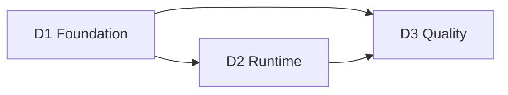

# 🛣️ Sprint 1 — Overview

## 1. 🧭 TL;DR

Sprint 1 is the **platform contract sprint**.

Its job is to complete the repository reset from an extension prototype history into a **governed, measurable, production-shaped platform baseline** that later sprints can safely extend. On this branch, the governed monorepo shape, root docs spine, verifier, hooks, workflows, and protected-path surfaces already exist. Sprint 1 closes the remaining truth-alignment gaps and leaves D2 and D3 with exact runtime and quality targets rather than reopening foundation decisions.

Sprint 1 is complete only when all three of these are simultaneously true:

* the repository has a stable foundation and no longer reads like a prototype
* the product has one real runtime path through the correct surfaces
* the runtime path is measurable, testable, secure, and enforceable through repository controls

Sprint 1 therefore has three deliverables:

* **D1 — Foundation**
* **D2 — Runtime**
* **D3 — Quality**

Each one has a different role:

* **Foundation** freezes structure, governance, naming, docs, and mainline quality posture
* **Runtime** proves the first real product path
* **Quality** proves the first measurable, enforceable, and comparison-ready proof system

---

## 2. 📌 Sprint purpose

Sprint 1 exists to eliminate the three biggest early-stage risks for the rebuild:

### 2.1 ⚠️ Structural drift

Without a stable repository, docs, and governance system, later work will create architecture by accident rather than by design.

### 2.2 ⚠️ Runtime illusion

Without a real service, job, auth, and durable write path, later work will still be building on shell-only behavior rather than platform truth.

### 2.3 ⚠️ Quality ambiguity

Without explicit observability, evaluation, accessibility, performance, and security baselines, later claims about improvement will be impossible to defend.

Sprint 1 is therefore not a “setup sprint” in the lightweight sense. It is the sprint that decides:

* what the platform is
* how it is built
* how it is measured
* how it protects itself
* how later work will prove that it improved anything

---

## 3. 🔍 Repo-grounded starting point

### 3.1 📦 Historical starting point that shaped Sprint 1

The historical repository baseline proved the original product concept as a browser extension. The visible root contained:

* `manifest.json`
* background and foreground scripts
* popup and options pages
* stylesheets
* assets
* one `README.md`
* one license file. ([github.com](https://github.com/SynaWeave/SynaWeave-ce))

The old README proved:

* local-first flashcard creation
* side-panel review
* spaced repetition
* TSV export
* the original MVP framing plus later stretch-goal ideas. ([github.com](https://github.com/SynaWeave/SynaWeave-ce))

### 3.2 📏 What this branch still does not yet prove

The current branch still does **not** yet prove:

* a web control plane
* a request-serving backend
* a background-job boundary
* bootable web, API, or ingest runtimes inside the new repo shape
* integrated auth across browser and web surfaces
* first durable operational writes in the rebuilt platform model
* supply-chain scanning
* a measurable product proof baseline

Sprint 1 closes exactly those gaps.

---

## 4. 🎯 Sprint-wide success definition

Sprint 1 is successful only if all of the following are true at close:

### 🧱 Foundation success

* the repository has a stable, shallow, semantic platform shape
* the root `docs/` folder is the canonical docs home
* there is only one README at root
* governance is complete
* naming and legend rules are explicit
* repo-contained governance controls are implemented and locally verifiable
* any hosted branch-protection, required-check, and scan settings are either confirmed on GitHub or explicitly called out as pending GitHub-side confirmation

### ⚙️ Runtime success

* the extension shell is real
* the web shell is real
* the request-serving backend is real
* the background-job boundary is real
* the reserved future runtime homes for MCP, ML, and evaluation stay explicit and stable
* one durable user-scoped runtime path exists
* the same user identity is visible across extension and web surfaces

### 👀 Quality success

* all critical runtime surfaces emit telemetry
* the first runtime path has baseline metrics
* required browser and accessibility checks exist
* security and supply-chain controls block invalid changes
* the first AI-ready proof path exists
* baseline performance numbers exist for later comparison

If any one of those three groups is incomplete, Sprint 1 is incomplete.

---

## 5. 🏗️ Sprint architecture objective

Sprint 1 must establish the first stable version of the platform shape.

### 5.1 🪟 Client surfaces

Sprint 1 must leave the platform with:

* a browser extension client
* a web control-plane shell
* root `docs/` as the canonical documentation system

### 5.2 ⚙️ Runtime surfaces

Sprint 1 must leave the platform with:

* a request-serving application
* a background job application
* reserved homes for `apps/mcp`, `apps/ml`, and `apps/eval`
* a shared auth boundary
* a first durable operational write path

### 5.3 🗃️ Data surfaces

Sprint 1 must leave the platform with:

* the first durable operational truth for the rebuild
* the first artifact or support storage boundary if required by the runtime slice
* a clear distinction between durable truth and support storage

### 5.4 👀 Proof surfaces

Sprint 1 must leave the platform with:

* telemetry
* dashboards
* baseline metrics
* baseline performance measurements
* baseline accessibility checks
* baseline security and supply-chain checks
* one AI-ready proof hook

---

## 6. 🧱 Sprint-wide frozen decisions

These decisions are frozen for Sprint 1 and should not be reopened inside Sprint 1 deliverables.

### 6.1 📚 Documentation home

* root `docs/` is the only canonical documentation home
* no separate docs runtime is introduced in Sprint 1
* only one README exists at repo root

### 6.2 🧩 Repo shape

* the repo is a shallow, semantic monorepo
* top-level domains must correspond to stable long-lived responsibilities
* later deliverables must extend the approved root shape rather than inventing alternate homes

### 6.3 🔐 Governance and open-core

* governance is complete in Sprint 1
* the core repo remains copyleft-licensed
* monetization remains outside the core repo
* monetization logic must not shape the core domain model

### 6.4 ✏️ Naming

* the naming contract is mandatory
* the abbreviation legend is mandatory
* provider names must not become core domain concepts

### 6.5 🌓 Design system

* the design system is token-first
* one shared visual language exists across product surfaces
* no independent app-local design systems are introduced

### 6.6 ⚙️ Runtime shape

* one request-serving application
* one background-job application
* reserved app homes already exist for MCP, ML, and evaluation work that lands later
* one browser-safe authentication baseline
* one durable operational write path
* no second docs runtime

### 6.7 👀 Proof stack

* OpenTelemetry is the base observability standard
* the Collector is the telemetry routing layer
* Prometheus and Grafana are the metrics and dashboard baseline
* Langfuse is the product-facing AI trace and evaluation baseline
* MLflow is the offline experiment, offline evaluation, and model lifecycle baseline
* CodeQL, dependency review, secret scanning, and push protection are part of the Sprint 1 quality system

OpenTelemetry explicitly defines a vendor-neutral observability model based on traces, metrics, and logs, and the Collector is explicitly the component that receives, processes, and exports telemetry. GitHub’s security features explicitly document code scanning, dependency review, and secret scanning as standard controls for public repositories. ([opentelemetry.io](https://opentelemetry.io/docs/concepts/observability-primer/); [opentelemetry.io](https://opentelemetry.io/docs/collector/architecture/); [docs.github.com](https://docs.github.com/code-security/code-scanning/introduction-to-code-scanning/about-code-scanning-with-codeql); [docs.github.com](https://docs.github.com/code-security/supply-chain-security/understanding-your-software-supply-chain/about-dependency-review); [docs.github.com](https://docs.github.com/code-security/secret-scanning/about-secret-scanning))

---

## 7. 🔄 Sprint dependency model

Sprint 1 is not three independent deliverables. It is one staged dependency chain.



### 7.1 📏 Dependency rules

* D2 cannot proceed honestly without D1
* D3 cannot proceed honestly without D1
* D3 also depends on the real runtime path proven in D2
* Sprint closeout depends on all three deliverables passing their own exit criteria and the sprint-level exit criteria

---

## 8. 🔀 Sprint-level safe parallelism

Sprint 1 supports concurrency, but only after specific serial truths are frozen.

### 8.1 🔗 Serial truths that must stabilize first

These must stabilize in order:

1. product and repo direction
2. repository and docs topology
3. governance and naming policy
4. runtime contract for the first user path
5. proof and quality-baseline categories

### 8.2 🔀 Safe parallel work once the serial truths are frozen

After those truths are frozen, the five-engineer team can work in parallel across these workstreams.

#### 📝 Workstream A — repo and docs spine

Primary scope:

* D1 repository topology
* root docs
* planning
* ADRs
* templates
* legend

#### 🔐 Workstream B — governance and controls

Primary scope:

* governance artifacts
* branch protection
* scan posture
* dependency review
* secret scanning
* push protection

#### 🪟 Workstream C — browser and web shells

Primary scope:

* extension shell
* web shell
* signed-in and signed-out states
* workspace shell
* user-path UX continuity

#### ⚙️ Workstream D — backend and data path

Primary scope:

* request-serving backend
* auth verification
* durable operational write
* job boundary
* local-production-like runtime path

#### 👀 Workstream E — proof and verification

Primary scope:

* telemetry
* metrics
* dashboards
* browser automation
* accessibility
* security verification
* performance baselines
* AI-ready trace baseline

### 🚫 8.3 Unsafe parallelism

The following should **not** be split across independent implementers without a single owner:

* browser auth and API auth semantics before the auth contract is frozen
* telemetry semantics for the same runtime path
* dashboard definitions for the same SLI family
* root docs and planning structure after the docs topology is frozen
* quality-gate logic spread across multiple workflow owners without one owner

### 📏 8.4 Sprint 1 handoff order

```text id="ba0l4f"
foundation truth freeze
        ↓
runtime contract freeze
        ↓
proof and metric freeze
        ↓
parallel workstreams
        ↓
cross-deliverable review
        ↓
Sprint 1 closeout
```

---

## 9. 🚚 Sprint 1 deliverables

### 9.1 🚚 Deliverable 1 — Foundation

**Purpose**
Create the repository, docs, governance, naming, and quality-control foundation.

**What it must prove**

* the repo has a stable shape
* the root docs system exists
* the governance system exists
* the naming and legend system exists
* the repo-contained verification baseline is real and locally verifiable
* hosted merge-enforcement claims are framed as expected posture unless GitHub-side confirmation exists

**What it must hand off**

* a repository that no longer reads as a prototype
* a complete docs spine
* a complete governance spine
* a reproducible bootstrap baseline
* an honest merge-control baseline that separates repo proof from GitHub-hosted settings

### 9.2 🚚 Deliverable 2 — Runtime

**Purpose**
Create the first real platform runtime path.

**What it must prove**

* extension shell
* web shell
* request-serving backend
* background job
* browser-safe auth
* one durable user-scoped action
* one cross-surface user identity path

**What it must hand off**

* a real runtime path
* baseline operational truth
* baseline auth and session continuity
* baseline performance and latency measurements for the critical path

### 9.3 🚚 Deliverable 3 — Quality

**Purpose**
Attach proof, quality, and enforcement to the first runtime path.

**What it must prove**

* telemetry
* dashboards
* baseline metrics
* accessibility
* security and supply-chain controls
* AI-ready trace and score baseline
* merge-blocking quality gates

**What it must hand off**

* a comparison-ready baseline for later product and AI work
* a runtime path that is now observable and enforceable
* a quality system later sprints can inherit instead of reinventing

---

## 📊 10. Sprint 1 baseline metrics

Sprint 1 is not only about building surfaces. It is also about creating the baseline measurement model that later work can compare against.

### 👤 10.1 Product and user-path metrics

Sprint 1 must record:

* sign-in initiation success
* sign-in completion success
* workspace entry success
* first backend-backed action success
* extension-to-web continuity success

Targets:

* all deterministic critical-path user actions: **100%**
* all smoke critical-path user actions: **100%**

### ⚙️ 10.2 Runtime reliability metrics

Sprint 1 must record:

* API availability
* API request success
* API p50, p95, p99 latency
* job success
* job p50 and p95 duration
* durable write success

These are standard service-level indicator categories under SRE practice. ([sre.google](https://sre.google/sre-book/service-level-objectives/))

Targets by end of Sprint 1:

* liveness success: **100%**
* readiness success: **100%**
* first durable action success: **100%**
* first job execution success: **100%**
* API p95 latency for the critical path: **< 800 ms**
* job p95 duration for the bounded Sprint 1 task: **< 60 s**

### 🌐 10.3 Browser and web performance metrics

Sprint 1 must record:

* extension load and side-panel timing
* web shell LCP
* web shell INP
* web shell CLS
* signed-in shell load timing

Current good Core Web Vitals thresholds are:

* LCP: **≤ 2.5 s**
* INP: **≤ 200 ms**
* CLS: **≤ 0.1** ([web.dev](https://web.dev/articles/vitals))

Targets by end of Sprint 1:

* Core Web Vitals baseline coverage for the main web path: **100%**
* side-panel open timing baseline coverage: **100%**

### 🔐 10.4 Security and quality metrics

Sprint 1 must record:

* browser privileged-key exposure count
* browser secret leakage count
* critical accessibility blocker count
* successful CodeQL run count
* successful dependency-review run count

Targets:

* browser privileged-key exposure count: **0**
* browser secret leakage count: **0**
* critical accessibility blocker count on Sprint 1 shell surfaces: **0**
* successful CodeQL runs on default branch: **≥ 1**
* successful dependency-review execution on PR path: **≥ 1**

### 🤖 10.5 AI-ready proof metrics

Sprint 1 must record:

* one AI-ready trace count
* one AI-ready score or evaluation count
* one AI-ready cost baseline

Targets:

* AI-ready trace path present: **yes**
* AI-ready scored path present: **yes**
* AI-ready cost baseline present: **yes**

---

## 🧪 11. Sprint 1 quality and DevSecOps contract

Sprint 1 must leave behind a repository that enforces good behavior across the full commit-to-merge path.

### 🧱 11.1 Commit-time controls

Commit-time controls must enforce, at minimum:

* format validation
* local lint where configured
* local type checks where configured
* local secret-leak prevention where supported
* commit-message policy from D1

### 🔗 11.2 Push-time controls

Push-time controls must enforce, at minimum:

* broader test execution
* broader type checks
* runtime-proof prerequisites for touched surfaces
* failure on obvious security regressions

### 🐙 11.3 Pull-request controls

Pull-request controls must enforce, at minimum:

* required checks
* code scanning
* dependency review
* docs alignment for architectural or runtime changes
* merge blocking when Sprint 1 critical checks fail

### 🔐 11.4 Security controls

GitHub’s documented security features provide the minimum repo-level baseline:

* CodeQL
* dependency review
* secret scanning
* push protection where supported. ([docs.github.com](https://docs.github.com/code-security/code-scanning/introduction-to-code-scanning/about-code-scanning-with-codeql); [docs.github.com](https://docs.github.com/code-security/supply-chain-security/understanding-your-software-supply-chain/about-dependency-review); [docs.github.com](https://docs.github.com/code-security/secret-scanning/about-secret-scanning); [docs.github.com](https://docs.github.com/en/code-security/concepts/secret-security/about-push-protection))

### ✅ 11.5 Sprint 1 DevSecOps acceptance

Sprint 1 is not complete unless:

* commit controls exist
* push controls exist
* PR controls exist
* required checks block invalid merges
* supply-chain and code-risk controls are active
* D2 and D3 runtime-sensitive diffs are subject to the same controls as all other work

---

## ✅ 12. Sprint 1 exit criteria

Sprint 1 is complete only when all of the following are true.

### ✅ 12.1 Foundation exit

* [ ] D1 passes all D1 exit criteria
* [ ] the repo no longer reads as a prototype
* [ ] the docs, planning, ADR, governance, legend, and design-system spines exist
* [ ] repo-contained governance and verification baselines are locally verified
* [ ] hosted branch-protection and security posture is either confirmed on GitHub or explicitly left as external confirmation pending

### ✅ 12.2 Runtime exit

* [ ] D2 passes all D2 exit criteria
* [ ] one real authenticated runtime path exists
* [ ] one durable user-scoped action exists
* [ ] extension and web surfaces converge on the same user truth

### ✅ 12.3 Quality exit

* [ ] D3 passes all D3 exit criteria
* [ ] all critical runtime surfaces emit telemetry
* [ ] dashboards exist for the critical path
* [ ] accessibility, security, and performance baselines are recorded
* [ ] one AI-ready trace and score baseline exists

### ✅ 12.4 Sprint-level measurable exit

* [ ] critical-path user-flow success = **100%** in deterministic validation
* [ ] critical-path smoke success = **100%**
* [ ] browser privileged-key exposure count = **0**
* [ ] critical accessibility blocker count = **0**
* [ ] baseline metric coverage for Sprint 1 critical path = **100%**
* [ ] handoff ambiguity count for Sprint 2 = **0**

---

## ❌ 13. Sprint failure conditions

Sprint 1 fails if any of these remain true:

* the repo still reads as an extension-only prototype
* the docs and planning system are still fragmented
* there is no real runtime path
* the first runtime path is not durable
* the first runtime path is not measurable
* there are no enforceable quality and security controls
* later sprints would still need to reinterpret the basic shape of the product and platform
* the repo has added a second docs home or a second README
* later product or AI improvements cannot be compared against Sprint 1 baselines

---

## ✅ 14. Acceptance standard

This Sprint 1 overview packet is correct only if a mid-level, senior, or staff engineer can answer all of these without consulting lower-level documents:

* What exact problem does Sprint 1 solve for the repository and product?
* How do the three deliverables differ, and how do they depend on each other?
* What platform truths are frozen for the whole sprint?
* What measurable baseline metrics must exist by the end of the sprint?
* How is safe parallelism organized for five engineers?
* What controls prevent unsafe code or unsafe configuration from reaching `main`?
* What exact conditions determine whether Sprint 1 is complete?
* What file and folder domains must exist by the end so the repo is fully prepared for later work?

If those answers are not explicit after reading this packet, the Sprint 1 overview spec is incomplete.
